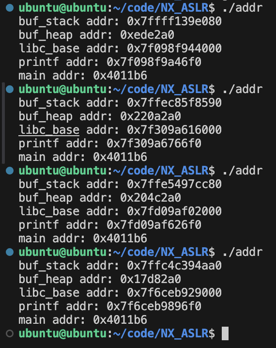

# NX&ASLR

---

## NX(No-eXecute)

- 실행에 사용되는 메모리 영역과 쓰기에 사용되는 메모리 영역을 분리하는 보호 기법
- cpu가 NX를 지원하면 컴파일러 옵션을 통해 바이너리에 NX를 적용할 수 있음 → NX가 적용된 바이너리는 실행 될 때 각 메모리 영역에 필요한 권한만을 부여 받음
    - gdb의 `vmmap` 으로 NX 적용 전후의 메모리 맵을 비교하면 코드 영역 외에 실행 권한이 없음
- `checksec` 을 이용한 NX 확인
    - `checksec` 을 이용하면 바이너리에 `NX` 가 적용되었는지 확인할 수 있음
- `NX` 의 다양한 명칭 참고
    - `NX` 를 인텔은 XD(eXcute Disable), AMD는 NX, 윈도우는 DEP(Data Execution Provention), ARM 에서는 XN(eXecute Never)라고 칭함
- Return to Shellcode w/t NX
    - `r2s.c` 를 `-zexecstack` 옵션을 제거해 컴파일하고, 익스폴로잇 코드를 실행하면 Segnmentation fault가 발생하는 것을 확인할 수 있음

## ASLR(Address Space Layout Randomization)

- 바이너리가 실행 될 때마다, 스택, 힙, 공유 라이브러리 등을 임의의 주소에 할당하는 보호 기법
- `ASLR` 은 커널에서 지원하는 보호기법이며 다음 명령으로 확인
    - `cat /proc/sys/kernel/randomize_va_space`
        - 0, 1, 2 값을 가짐
            - No ASLR(0) : ASLR을 적용하지 않음
            - Conservative Randomization(1) : 스택, 라이브러리, vdso(Virtual Dynamic Shared Object) 등
            - Conservative Randomization(2) : (1)영역과 `brk` 로 할당한 영역
                - `brk` 는 힙(Heap) 메모리를 관리하는 시스템 콜로, 프로세스의 데이터 세그먼트 끝 부분을 조정하여 힙 영역의 크기를 변경합니다.

### ASLR 예제 코드

- 메모리의 주소를 출력하는 코드

```python
// Name: addr.c
// Compile: gcc addr.c -o addr -ldl -no-pie -fno-PIE

#include <dlfcn.h>
#include <stdio.h>
#include <stdlib.h>

int main() {
  char buf_stack[0x10];                   // 스택 버퍼
  char *buf_heap = (char *)malloc(0x10);  // 힙 버퍼

  printf("buf_stack addr: %p\n", buf_stack);
  printf("buf_heap addr: %p\n", buf_heap);
  printf("libc_base addr: %p\n",
         *(void **)dlopen("libc.so.6", RTLD_LAZY));  // 라이브러리 주소

  printf("printf addr: %p\n",
         dlsym(dlopen("libc.so.6", RTLD_LAZY),
               "printf"));  // 라이브러리 함수의 주소
  printf("main addr: %p\n", main);  // 코드 영역의 함수 주소
}
```

### ASLR의 특징



- 코드 영역의 `main` 함수를 제외한 다른 영역의 주소들은 실행할 떄마다 변경
    - 실행할 때 마다 주소가 변경되기 때문에 바이너를 실행하기 전에 해당 영역들의 주소를 예측할 수 없음
- 바이너리를 반복해서 실행해도 `libc_base` 주소 하위 12비트 값과 `printf` 주소 하위 12비트 값은 변경되지 않음
    - 리눅스는 ASLR이 적용됐을 때, 파일을 페이지(page) 단위로 임의 주소에 매핑함
    - 페이지의 크기인 12비트 이하로는 주소가 변경되지 않음
- `libc_base` 와 `printf` 의 주소 차이는 항상 같음
    - ALSR이 적용되면, 라이브러리는 임의 주소에 매핑함 그러나, 라이브러리 파일을 그대로 매핑하는 것이므로 매핑된 주소로부터 라이브러리의 다른 심볼들 까지의 거리(Offset)은 항상 같음
    
    ```python
    >>> hex(0x7fd7504cd000 - 0x7fd750531f00) # libc_base addr - printf addr
    '-0x64f00'
    >>> hex(0x7ffad9e1b000 - 0x7ffad9e7ff00)
    '-0x64f00'
    ```
    
    ```python
    $ objdump -D /lib/x86_64-linux-gnu/libc.so.6 | grep 064f00 -A3
    0000000000064f00 <_IO_printf@@GLIBC_2.2.5>:
       64f00: 48 81 ec d8 00 00 00  sub    $0xd8,%rsp
       64f07: 84 c0                 test   %al,%al
       64f09: 48 89 74 24 28        mov    %rsi,0x28(%rsp)
    ```
    

### 우회 방법

- 바이너리의 코드가 존재하는 영역은 여전히 **실행 권한이 존재하며, 할당되는 주소도 고정되어 있음**
    - 이들을 활용하면 NX와 ASLR을 우회화여 공격할 수 있음
    - 대표적인 공격방법
        - **Return-to-Libc(RTL)과 Return Oriented Programming (ROP)가 있음**

---

## Library - Static Link vs. Dynamic Link

### 라이브러리

- 컴퓨터 시스템에서, 프로그램들이 함수나, 변수를 공유해서 사용
    - 대표적으로 C의 표준 라이브러리인 `libc` 는 우분투에서 기본으로 탑재된 라이브러리
        - `/libc/x86-64-linux-gnu/libc.so.6` 에 있음
        - printf가 `libc` 에 이미 정의되어 있음

### 링크(Link)

- 컴파일의 마지막 단계
  
    ```c
    // Name: hello-world.c
    // Compile: gcc -o hello-world hello-world.c
    
    #include <stdio.h>
    
    int main() {
      puts("Hello, world!");
      return 0;
    }
    ```
    
- 프로그램에서 어떤 라이브러리의 함수를 사용한다면, 호출된 함수나 실제 라이브러리의 함수가 링크 과정에서 연결됨
- 리눅스에서 C 소스 코드는 전처리, 컴파일, 어셈블 과정을 거쳐 ELF 형식을 갖춘(objectfile)로 번역됨
  
    ```c
    $ gcc -c hello-world.c -o hello-world.o
    ```
    
    - 오브젝트 파일은 실행 가능한 형식을 갖추고 있지만, 라이브러리 함수들의 정의가 어디 있는지 알지 못하므로 실행은 불가능
        - `readelf -s helloworld.o | grep puts` 명령을 실행
            - `puts` 선언이 stdio.h에 있어서 심볼(Symbol)로는 기록되어 있지만, 자세한 내용은 하나도 기록되어 있지 않음
                - 심볼과 관련된 정보들을 찾아 최종 실행파일에 기록하는 것이 링크 과정에서 하는 일
            
            ```c
            $ readelf -s hello-world.o | grep puts
                11: 0000000000000000     0 NOTYPE  GLOBAL DEFAULT  UND puts
            ```
    
- 예제를 완전히 컴파일 하고 다음 명령어를 통해 링크 되기 전과 비교
  
    ```c
    $ gcc -o hello-world hello-world.c
    $ readelf -s hello-world | grep puts
         2: 0000000000000000     0 FUNC    GLOBAL DEFAULT  UND puts@GLIBC_2.2.5 (2)
        46: 0000000000000000     0 FUNC    GLOBAL DEFAULT  UND puts@@GLIBC_2.2.5
    $ ldd hello-world
            linux-vdso.so.1 (0x00007ffec3995000)
            libc.so.6 => /lib/x86_64-linux-gnu/libc.so.6 (0x00007fee37831000)
            /lib64/ld-linux-x86-64.so.2 (0x00007fee37e24000)
    ```
    
    - `libc` 에서 `puts` 의 정의를 찾아 연결한 것을 확인할 수 있음
    - `libc`를 같이 컴파일하지 않았음에도 `libc` 에서 해당 심볼을 탐색 한 것은, `libc` 가 있는 `/lib/x86-64-linux-gnu/` 가 표준 라이브러리 경로에 포함되어 있기 때문
    - gcc는 소스코드를 컴파일 할 때, 표준 라이브러리의 라이브러리 파일들을 모두 탐색함
        - 다음 명령어로 표준 라이브러리 경로를 확인 할 수 있음
        
        ```c
        $ ld --verbose | grep SEARCH_DIR | tr -s ' ;' '\n'
        SEARCH_DIR("=/usr/local/lib/x86_64-linux-gnu")
        SEARCH_DIR("=/lib/x86_64-linux-gnu")
        SEARCH_DIR("=/usr/lib/x86_64-linux-gnu")
        SEARCH_DIR("=/usr/lib/x86_64-linux-gnu64")
        SEARCH_DIR("=/usr/local/lib64")
        SEARCH_DIR("=/lib64")
        SEARCH_DIR("=/usr/lib64")
        SEARCH_DIR("=/usr/local/lib")
        SEARCH_DIR("=/lib")
        SEARCH_DIR("=/usr/lib")
        SEARCH_DIR("=/usr/x86_64-linux-gnu/lib64")
        SEARCH_DIR("=/usr/x86_64-linux-gnu/lib")
        ```
        
    - `link` 를 거치고 나면 프로그램에서 `puts` 를 호출할 때, `puts` 의 정의가 있는 `libc` 에서 `puts` 코드를 찾고, 해당 코드를 실행함

### 라이브러리와 링크 종류

- 동적 링크 - 동적 라이브러리를 링크하는 것
    - 동적 링크된 바이너리를 실행하면 동적 라이브러리가 프로세스의 메모리에 매핑
    - 실행 중 라이브러리 함수를 호출하면 매핑된 라이브러리에서 호출할 함수의 주소를 찾고, 그 함수를 실행
- 정적 링크 - 정적 라이브러리를 링크하는 것
    - 정적 링크를 하면 바이너리에서 정적 라이브러리의 필요한 모든 함수가 포함
    - 해당 함수를 호출할 때, 라이브러리를 참조하는 것이 아니라, 자신의 함수를 호출하는 것처럼 사용
        - 라이브러리에서 원하는 함수를 찾지 않아도 되니 탐색 비용 절감 but, 여러 바이너리에서 복제가 이루어져 용량 낭비
- 동적 링크 vs 정적 링크
  
    ```c
    $ gcc -o static hello-world.c -static
    $ gcc -o dynamic hello-world.c -no-pie
    ```
    
    - 용량 - 각각의 용량을 비교해보면 `static` 이 `dynamic` 보다 50배 더 많이 차지함
    - 호출 방법
        - `static` 에서는 `puts` 가 있는 `0x40c140` 을 직접 호출
        
        ```c
         main:
          push   rbp
          mov    rbp,rsp
          lea    rax,[rip+0x96880] # 0x498004
          mov    rdi,rax
          call   0x40c140 <puts>
          mov    eax,0x0
          pop    rbp
          ret
        ```
        
        - `dynamic` 에서는 `plt` 주소인 `0x401040` 을 호출
            - 동적 링크된 바이너리는 함수의 주소를 라이브러리에서 “찾아야” 하기 때문
            - `plt` 는 이 과정에서 사용되는 테이블
        
        ```c
        main: 
         push   rbp
         mov    rbp,rsp
         lea    rdi,[rip+0xebf] # 0x402004
         mov    rdi,rax
         call   0x401040 <puts@plt>
         mov    eax,0x0
         pop    rbp
         ret
        ```
        

### PLT와 GOT

- **PLT(Procedure Linkage Table)와 GOT(Global Offset Table)는** 라이브러리에서 동적 링크된 심볼의 주소를 찾을 때 사용하는 테이블
- 바이너리가 실행되면 ASLR에 의해 라이브러리가 임의의 주소에 매핑
    - 해당 상태에서 라이브러리 함수를 호출하면, 함수의 이름을 바탕으로 라이브러리에서 심볼들을 탐색하고, 해당 함수의 정의를 발견하면 그 주소로 실행 흐름을 옮기게 됨
    - 이 전 과정을 통틀어 `runtime resolve` 라고 함
- 그런데 만약 반복적으로 호출되는 함수의 정의를 매번 탐색해야 한다면 비효율적임
    - 그래서 ELF는 **GOT라는 테이블**을 두고, resolve된 함수의 주소를 해당 테이블에 저장함
    - 그리고 나중에 다시 해당 함수를 호출하면 저장된 주소를 꺼내서 사용

```c
// Name: got.c
// Compile: gcc -o got got.c -no-pie

#include <stdio.h>

int main() {
  puts("Resolving address of 'puts'.");
  puts("Get address from GOT");
}
```

### resolve되기 전

- `got.c`를 컴파일하고 실행한 직후 GOT의 상태를 보여주는 명령어인 `got` 를 사용
    - `puts` 의 GOT 엔트리인 `0x404018`에는 아직 `puts` 의 주소를 찾기 전이므로, 함수 주소 대신 .plt 섹션 어딘가의 주소인 `0x401030` 이 적혀 있음

```c
$ gdb ./got
pwndbg> entry
pwndbg> got
GOT protection: Partial RELRO | GOT functions: 1
[0x404018] puts@GLIBC_2.2.5 -> 0x401030 ◂— endbr64

pwndbg> plt
Section .plt 0x401020-0x401040:
No symbols found in section .plt
pwndbg>
```

- `main()` 에서 `puts@plt` 를 호출하는 지점에 중단점을 설정
- PLT에서는 `puts` 의 GOT엔트리에 쓰인 값인 `0x401030` 으로 실행 흐름을 옮김
- pwndb 컨텍스트에서 `DISASM` 부분은 프로그램에서 명령어가 호출되는 순서인 제어 흐름(Control flow)를 보여주는데, 실행 흐름을 따라가면 `_dl_runtime_reslove_fxsave` 가 호출될 것임을 알 수 있음

```c
pwndbg> b *main+18
pwndbg> c
...
──────────────────────[ DISASM / x86-64 / set emulate on ]──────────────────────
   0x40113e <main+8>     lea    rax, [rip + 0xebf]
   0x401145 <main+15>    mov    rdi, rax
 ► 0x401148 <main+18>    call   puts@plt                      <puts@plt>
        s: 0x402004 ◂— "Resolving address of 'puts'."
...
pwndbg> si
...
──────────────────────[ DISASM / x86-64 / set emulate on ]──────────────────────
 ► 0x401040       <puts@plt>                        endbr64
   0x401044       <puts@plt+4>                      bnd jmp qword ptr [rip + 0x2fcd]     <0x401030>
    ↓
   0x401030                                         endbr64
   0x401034                                         push   0
   0x401039                                         bnd jmp 0x401020                     <0x401020>
    ↓
   0x401020                                         push   qword ptr [rip + 0x2fe2]      <_GLOBAL_OFFSET_TABLE_+8>
   0x401026                                         bnd jmp qword ptr [rip + 0x2fe3]     <_dl_runtime_resolve_fxsave>
    ↓
   0x7ffff7fd8be0 <_dl_runtime_resolve_fxsave>      endbr64
   0x7ffff7fd8be4 <_dl_runtime_resolve_fxsave+4>    push   rbx
   0x7ffff7fd8be5 <_dl_runtime_resolve_fxsave+5>    mov    rbx, rsp
   0x7ffff7fd8be8 <_dl_runtime_resolve_fxsave+8>    and    rsp, 0xfffffffffffffff0
...
```

- 코드를 조금 더 실행시키면 `_dl_runtime_resolve_fxsave` 라는 함수가 실행 됨
- 해당 함수에서 `puts` 의 주소가 구해지고, GOT 엔트리에 주소를 씀
- 실제로 `ni` 명령어를 반복적으로 수행해 `_dl_runtime_resolve_fxsave` 안으로 진입한 후, `finish` 명령어로 함수를 빠져나오면, `puts` 의 GOT 엔트리에 libc 영역 내 실제 puts 주소인 `0x7ffff7e02ed0` 가 쓰여 있는 모습을 확인할 수 있음

```c
pwndbg> ni
...
pwndbg> ni
_dl_runtime_resolve_fxsave () at ../sysdeps/x86_64/dl-trampoline.h:67
67  ../sysdeps/x86_64/dl-trampoline.h: No such file or directory.
...
──────────────────────[ DISASM / x86-64 / set emulate on ]──────────────────────
   0x401030                                          endbr64
   0x401034                                          push   0
   0x401039                                          bnd jmp 0x401020                     <0x401020>
    ↓
   0x401020                                          push   qword ptr [rip + 0x2fe2]      <_GLOBAL_OFFSET_TABLE_+8>
   0x401026                                          bnd jmp qword ptr [rip + 0x2fe3]     <_dl_runtime_resolve_fxsave>
    ↓
 ► 0x7ffff7fd8be0 <_dl_runtime_resolve_fxsave>       endbr64
   0x7ffff7fd8be4 <_dl_runtime_resolve_fxsave+4>     push   rbx
   0x7ffff7fd8be5 <_dl_runtime_resolve_fxsave+5>     mov    rbx, rsp
   0x7ffff7fd8be8 <_dl_runtime_resolve_fxsave+8>     and    rsp, 0xfffffffffffffff0
   0x7ffff7fd8bec <_dl_runtime_resolve_fxsave+12>    sub    rsp, 0x240
   0x7ffff7fd8bf3 <_dl_runtime_resolve_fxsave+19>    mov    qword ptr [rsp], rax
...
pwndbg> finish
Run till exit from #0  _dl_runtime_resolve_fxsave () at ../sysdeps/x86_64/dl-trampoline.h:67
Resolving address of 'puts'.
...
──────────────────────[ DISASM / x86-64 / set emulate on ]──────────────────────
   0x401148 <main+18>    call   puts@plt                      <puts@plt>

 ► 0x40114d <main+23>    lea    rax, [rip + 0xecd]
   0x401154 <main+30>    mov    rdi, rax
   0x401157 <main+33>    call   puts@plt                      <puts@plt>

   0x40115c <main+38>    mov    eax, 0
   0x401161 <main+43>    pop    rbp
   0x401162 <main+44>    ret

   0x401163              add    bl, dh
...
pwndbg> got
GOT protection: Partial RELRO | GOT functions: 1
[0x404018] puts@GLIBC_2.2.5 -> 0x7ffff7e02ed0 (puts) ◂— endbr64
pwndbg> vmmap 0x7ffff7e02ed0
LEGEND: STACK | HEAP | CODE | DATA | RWX | RODATA
             Start                End Perm     Size Offset File
    0x7ffff7daa000     0x7ffff7f3f000 r-xp   195000  28000 /usr/lib/x86_64-linux-gnu/libc.so.6 +0x58ed0
```

### resolve된 후

`puts@plt` 를 두 번째로 호출할 때는 `puts` 의 GOT 엔트리에 실제 `puts` 의 주소인 `0x7ffff7e02ed0` 가 쓰여있어서 바로 `puts` 가 실행됨

```c
pwndbg> b *main+33
pwndbg> c
...
──────────────────────[ DISASM / x86-64 / set emulate on ]──────────────────────
   0x401148 <main+18>    call   puts@plt                      <puts@plt>

   0x40114d <main+23>    lea    rax, [rip + 0xecd]
   0x401154 <main+30>    mov    rdi, rax
 ► 0x401157 <main+33>    call   puts@plt                      <puts@plt>
        s: 0x402021 ◂— 'Get address from GOT'
...
pwndbg> si
...
──────────────────────[ DISASM / x86-64 / set emulate on ]──────────────────────
 ► 0x401040       <puts@plt>      endbr64
   0x401044       <puts@plt+4>    bnd jmp qword ptr [rip + 0x2fcd]     <puts>
    ↓
   0x7ffff7e02ed0 <puts>          endbr64
   0x7ffff7e02ed4 <puts+4>        push   r14
   0x7ffff7e02ed6 <puts+6>        push   r13
   0x7ffff7e02ed8 <puts+8>        push   r12
   0x7ffff7e02eda <puts+10>       mov    r12, rdi
   0x7ffff7e02edd <puts+13>       push   rbp
   0x7ffff7e02ede <puts+14>       push   rbx
   0x7ffff7e02edf <puts+15>       sub    rsp, 0x10
   0x7ffff7e02ee3 <puts+19>       call   *ABS*+0xa8720@plt                <*ABS*+0xa8720@plt>
...
```

### 시스템 해킹의 관점에서 본 PLT와 GOT

- PLT와 GOT는 동적 링크된 바이너리에서 라이브러리 함수의 주소를 찾고, 기록할 때 사용되는 중요한 테이블
- 그런데, 시스템 해커의 관점에서 보면 PLT에서 GOT를 참조하여 실행 흐름을 옮길 때, GOT의 값을 검증하지 않는다는 보안상의 약점이 있음
- 만약 `puts` 의 GOT 엔트리에 저장된 값을 공격자가 임의로 변경할 수 있으면, `puts` 가 호출될 때 공격자가 원하는 코드가 실행되게 할 수 있음
- GOT 엔트리에 저장된 값을 임의로 변조할 수 있는 수단이 있음을 가정하고, 이 공격 기법이 가능한지 gdb를 이용하여 간단하게 실험을 해볼 수 있음
- `get` 바이너리에서 `main()` 내 두 번째 `puts()`  호출 직전에 `puts` 의 GOT 엔트리를 “AAAAAAAA”로 변경한 후 실행시키면, 실제로 “AAAAAAAA”로 실행 흐름이 옮겨지는 것을 확인할 수 있음
    - `pwndbg> set *(unsigned long long *)0x404018 = 0x4141414141414141`

```c
$ gdb -q ./got
pwndbg> b *main+33
pwndbg> r
...
──────────────────────[ DISASM / x86-64 / set emulate on ]──────────────────────
 ► 0x401157 <main+33>    call   puts@plt                      <puts@plt>
        s: 0x402021 ◂— 'Get address from GOT'

   0x40115c <main+38>    mov    eax, 0
pwndbg> got
GOT protection: Partial RELRO | GOT functions: 1
[0x404018] puts@GLIBC_2.2.5 -> 0x7ffff7e02ed0 (puts) ◂— endbr64

pwndbg> set *(unsigned long long *)0x404018 = 0x4141414141414141

pwndbg> got
GOT protection: Partial RELRO | GOT functions: 1
[0x404018] puts@GLIBC_2.2.5 -> 0x4141414141414141 ('AAAAAAAA')
pwndbg> c
Continuing.

Program received signal SIGSEGV, Segmentation fault.
0x0000000000401044 in puts@plt ()
...
──────────────────────[ DISASM / x86-64 / set emulate on ]──────────────────────
 ► 0x401044 <puts@plt+4>    bnd jmp qword ptr [rip + 0x2fcd]     <0x4141414141414141>
```

- 이와 같이 GOT 엔트리에 임의의 값을 오버라이트(Overwrite)하여 실행 흐름을 변조하는 공격 기법을 **GOT Overwrite**라고 부름
    - 일반적으로 임의 주소에 임의의 값을 오버라이트하는 수단을 가지고 있을 때 수행하는 공격 기법