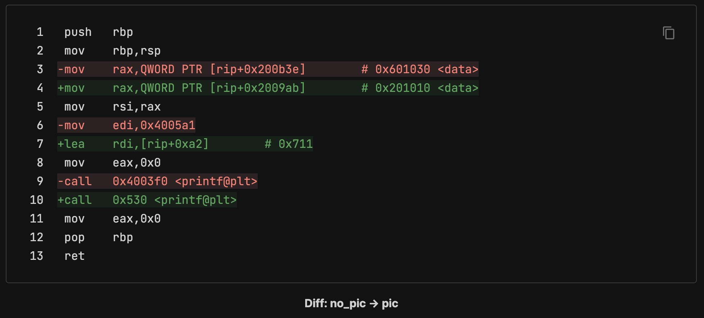

# PIC & PIE

---

## PIC

- 리눅스에서 ELF는 실행파일(Executable)과 공유 오브젝트(Shared Object, SO)로 두 가지가 존재
    - 실행파일 = addr(일반적인 실행파일)
    - 공유 오브젝트 = libc.so와 같은 라이브러리
        - 공유 오브젝트는 기본적으로 재배치(Relocation)가 가능하도록 설계
            - 재배치가 가능 = 메모리의 어느 주소에 적재되어도 코드의 의미가 훼손되지 않음
                - 이런 성질을 만족하는 코드를 `Position-Independent Code(PIC)` 라고 함

### PIC 코드 분석

```python
// Name: pic.c
// Compile: gcc -o pic pic.c
// 	      : gcc -o no_pic pic.c -fno-pic -no-pie
#include <stdio.h>
char *data = "Hello World!";
int main() {
  printf("%s", data);
  return 0;
}
```

- `no-pic` 와 `pic` 의 `main` 함수를 비교해보면, `main+33` 에서 “%s” 문자열을 `printf` 에 전달하는 방식이 다름
    - `no_pic`에서는 `0x4005a1`라는 절대 주소로 문자열을 참조하고 있음
    - 반면 `pic`는 문자열의 주소를 `rip+0xa2`로 참조하고 있음
- 바이너리가 매핑되는 주소가 바뀌면 `0x4005a1` 에 있던 데이터도 함께 이동하므로 `no_pic` 에 코드는 제대로 실행되지 못함
- 그러나 `pic` 에 코드는 `rip` 를 기준으로 데이터를 상대참조하기 때문에 바이너리가 무작위 주소에 매핑돼도 제대로 실행이 가능
  
    
    

## PIE

- `Position-Independent Executable(PIE)`은 무작위 주소에 매핑돼도 실행 가능한 실행 파일을 뜻함
    - ASLR이 도입되기 전 실행 파일을 무작위 주소에 매핑할 필요가 없었음
    - 리눅스의 실행 파일 형식은 재배치를 고려하지 않고 설계됨
    - **이후 ASLR이 도입되었을 때 실행 파일도 무작위 주소에 매핑될 수 있게 하고 싶었으나, 이미 사용되는 실행 파일의 형식을 변경하면 호환성 문제가 발생할 것이 분명했음**
    - **개발자들은 원래 재배치가 가능했던 공유 오브젝트를 실행 파일로 사용하기로 함**
- 실제로 리눅스의 기본 실행 파일 중 하나인 `/bin/ls` 의 파일 헤더를 보면 `Type` 이 공유 오브젝트를 나타내는 `DYN`(`ET_DYN`)임을 알 수 있음
  
    ```python
    $ readelf -h /bin/ls
    ELF Header:
      Magic:   7f 45 4c 46 02 01 01 00 00 00 00 00 00 00 00 00
      Class:                             ELF64
      Data:                              2's complement, little endian
      Version:                           1 (current)
      OS/ABI:                            UNIX - System V
      ABI Version:                       0
      Type:                              DYN (Position-Independent Executable file)
      Machine:                           Advanced Micro Devices X86-64
      Version:                           0x1
      Entry point address:               0x6ab0
      Start of program headers:          64 (bytes into file)
      Start of section headers:          136224 (bytes into file)
      Flags:                             0x0
      Size of this header:               64 (bytes)
      Size of program headers:           56 (bytes)
      Number of program headers:         13
      Size of section headers:           64 (bytes)
      Number of section headers:         31
      Section header string table index: 30
    ```
    

### PIE on ASLR

- PIE는 재배치가 가능하므로, ASLR이 적용된 시스템에서는 실행 파일도 무작위 주소에 적재됨
- 반대로, ASLR이 적용되지 않은 시스템에서는 PIE가 적용된 바이너리더라도 무작위 주소에 적재되지 않음

## PIE 우회

### PIE 우회

- 코드 베이스 구하기
    - ASLR 환경에서 PIE가 적용된 바이너리는 실행될 때 마다 다른 주소에 적재됨
    - 그래서 코드 영역의 가젯을 사용하거나, 데이터 영역에 접근하려면 바이너리가 적재된 주소를 알아야함
        - **PIE 베이스, 코드 베이스** 라고함
- **Partial Overwrite**
    - **코드 베이스**를 구하기 어렵다면 반환 주소의 일부 바이트만 덮는 공격을 고려해볼 수 있음
    - 이러한 공격 기법을 `Partial Overwrite`라고 부름
        - 일반적으로 함수의 반환 주소는 호출 함수(Caller)의 내부를 가리킴
        - 특정 함수의 호출 관계는 정적 분석 또는 동적 분석으로 쉽게 확인할 수있으므로, 공격자는 반환 주소를 예측할 수 있음
    - `ASLR`의 특성 상, 코드 영역의 주소도 하위 12비트 값은 항상 같음
        - 따라서 사용하려는 코드 가젯의 주소가 반환 주소와 하위 한 바이트만 다르다면, 이 값만 덮어 원하는 코드를 실행 시킬 수 있음
        - 만약 두 바이트 이상이 다른 주소로 실행 흐름을 옮기고자 한다면, ASLR로 뒤섞이는 주소를 맞춰야 하므로 브루트 포싱이 필요하며, 공격이 확률에 따라 성공하게 됨