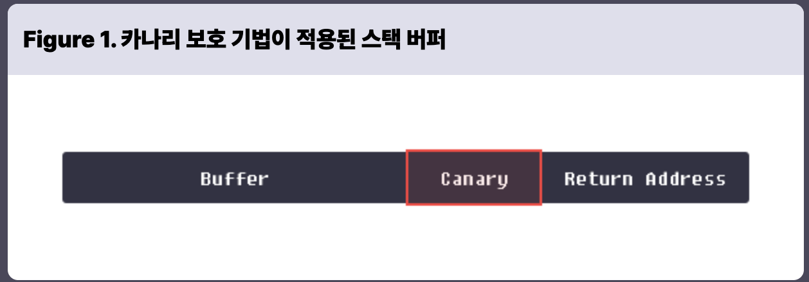

# Stack Canary

---

### 스택 카나리

```c
// Name: canary.c
#include <unistd.h>
int main() {
  char buf[8];
  read(0, buf, 32);
  return 0;
```

- **함수의 프롤로그에서 스택 버퍼와 반환 주소 사이에 임의의 값을 삽입하고, 함수의 에필로그에서 해당 값의 변조를 확인하는 보호 기법**
    - 카나리 값의 변조가 확인되면 프로세스는 강제로 종료됨
- 스택 버퍼 오버플로우로 반환 주소를 덮으려면 반드시 카나리를 먼저 덮어야 하므로 카나리 값을 모르는 공격자는 반환자를 덮을 때, 카나리 값을 변조하게 됨. → 에필로그에서 변조가 확인되어 프로세스 종료



### 카나리 정적 분석

- 카나리 비활성화
    - gcc는 기본적으로 스택 카나리를 적용하여 바이너리를 컴파잃함
        - `-fno-stack-protector` 옵션을 추가해야 카나리 없이 컴파일 가능
- 카나리 활성화
    - 카나리를 적용하여 다시 컴파일하고, 긴 입력을 주면 `segmentation fault` 가 아니라 `stack smashing detected` 와 `Aborted` 에러가 발생
        - 스택 버퍼오버플로우가 탐지되어 프로세스가 강제 종료 되었음을 의미
    - no_canary 와 디스어셈블 결과 비교
    
    
    
    
    

### 카나리 동적 분석

- 카나리 저장
    - `main+8` 은 `fs:0x28` 의 데이터를 읽어서 `rax` 에 저장
        - `fs` 는 세그먼트 레지스터의 일종으로, 리눅스는 프로세스가 시작 될 때, `fs:0x28` 에 랜덤 값을 저장
            - 따라서 `main+8` 의 결과로 `rax` 에는 리눅스가 생성한 랜덤 값 저장
                - `cs` , `ds` , `es` 는 CPU가 사용 목적을 명시한 레지스터인 반면, `fs` 와 `gs` 는 목적이 정해지지 않아 운영체제가 임의로 사용할 수 있는 레지스터
                - `fs` 는 리눅스에서 `Thread Local Storage(TLS)` 를 가리키는 포인터로 사용함
                    - TLS에 카나리를 비롯하여 프로세스 실행에 필요한 여러 데이터가 저장됨
            - `main+17` 에서 `rbp-0x8` 에 랜덤 값이 저장됨
        
        ```python
        $ gdb -q ./canary
        pwndbg> break *main+8
        Breakpoint 1 at 0x6b2
        pwndbg> run
         ► 0x5555555546b2 <main+8>     mov    rax, qword ptr fs:[0x28] <0x5555555546aa>
           0x5555555546bb <main+17>    mov    qword ptr [rbp - 8], rax
           0x5555555546bf <main+21>    xor    eax, eax
        ```
    
- 카나리 검사
    - `main+50` 은 `rbp-8` 에 저장한 카나리를 `rcx` 로 옮김
    - `main+54` 에서 `rcx` 를 `fs:0x28` 에 저장된 카나리와 XOR
        - 두 값이 동일하면 값이 0이 되면서 `je` 조건을 만족, main 함수는 정상적으로 반환됨
        - 그러나 두 값이 동일하지 않으면, `__stack_check_fail` 이 호출 되면서 프로그램이 강제로 종료됨
        
        ```python
        pwndbg> break *main+50
        pwndbg> continue
        HHHHHHHHHHHHHHHH
        Breakpoint 2, 0x00000000004005c8 in main ()
         ► 0x5555555546dc <main+50>    mov    rcx, qword ptr [rbp - 8] <0x7ffff7af4191>
           0x5555555546e0 <main+54>    xor    rcx, qword ptr fs:[0x28]
           0x5555555546e9 <main+63>    je     main+70 <main+70>
            ↓
           0x5555555546f0 <main+70>    leave
           0x5555555546f1 <main+71>    ret
        ```
        

### 카나리 생성 과정

- 카나리 값은 프로세스가 시작 될 때, TLS에 전역변수로 저장되고, 각 함수마다 프롤로그와 에필로그에서 이 값을 참조함
- TLS의 주소 파악
    - `fs` 는 TLS를 가리키므로 `fs` 의 값을 알면 TLS의 주소를 알 수 있음
        - 그러나 리눅스에서 `fs` 의 값은 특정 시스템 콜을 사용해야만 조회하거나 설정이 가능
            - `info register fs` 나 `print $fs` 같은 방식으로 값을 알 수 없음
        - 그래서 여기서는 `fs` 의 값을 설정할 때 호출되는 `arch_prctl(int code, unsigned long addr)` 시스템 콜에 중단점을 설정하여 `fs` 가 어떤 값으로 설정되는지 조사
            - 이 시스템 콜을 `arch_prctl(ARCH_SET_FS, addr)` 의 형태로 호출하면 `fs` 의 값은 `addr` 로 설정
                - gdb에는 특정 이벤트가 발생 했을 때, 프로세스를 중지시키는 `catch` 명령어가 있음
                - 이 명령어로 `arch_prctl` 에 checkpoint를 설정하고 `canary` 를 실행
                
                ```c
                $ gdb -q ./canary
                pwndbg> catch syscall arch_prctl
                Catchpoint 1 (syscall 'arch_prctl' [158])
                pwndbg> run
                ```
                
            - `init_tls()` 안에서 `checkpoin` 에 도달할 때까지 continue 명령실행
                - checkpoint에 도달 했을 때, `rdi` 값이 `0x1002` 인데 이 값은 `ARCH_SET_FS` 의 상숫값
                - `rsi` 값이 `0x7ffff7d7f740` 이므로, 이 프로세스는 TLS를 `0x7ffff7d7f740`에 저장하고, `fs` 는 이를 가리키게 됨
                - 카나리가 저장될 `fs+0x28(0x7ffff7d7f740+0x28)`의 값을 보면 아직 어떠한 값도 설정되지 않은 것을 알 수 있음
            
            ```c
            pwndbg> c
            ...
            pwndbg> c
            Continuing.
            Catchpoint 1 (call to syscall arch_prctl), init_tls (naudit=naudit@entry=0) at ./elf/rtld.c:818
            818 ./elf/rtld.c: No such file or directory.
            ...
            ─────────────[ REGISTERS / show-flags off / show-compact-regs off ]─────────────
            *RAX  0xffffffffffffffda
            *RBX  0x7fffffffe090 ◂— 0x1
            *RCX  0x7ffff7fe3e1f (init_tls+239) ◂— test eax, eax
            *RDX  0xffff80000827feb0
            *RDI  0x1002
            *RSI  0x7ffff7d7f740 ◂— 0x7ffff7d7f740
            ...
            ──────────────────────[ DISASM / x86-64 / set emulate on ]──────────────────────
             ► 0x7ffff7fe3e1f     test   eax, eax
               0x7ffff7fe3e21     jne    init_tls+320                
                ↓
               0x7ffff7fe3e70     lea    rsi, [rip + 0x11641]
               0x7ffff7fe3e77     lea    rdi, [rip + 0x11672]
               0x7ffff7fe3e7e     xor    eax, eax
               0x7ffff7fe3e80     call   _dl_fatal_printf                <_dl_fatal_printf>
               0x7ffff7fe3e85     nop    dword ptr [rax]
               0x7ffff7fe3e88     xor    ecx, ecx
               0x7ffff7fe3e8a     jmp    init_tls+161                
               0x7ffff7fe3e8f     lea    rcx, [rip + 0x11be2]          <__pretty_function__.14>
               0x7ffff7fe3e96     mov    edx, 0x31b
            ...
            pwndbg> info register $rdi
            rdi            0x1002              4098
            pwndbg> info register $rsi
            rsi            0x7ffff7d7f740      140737351513920
            pwndbg> x/gx 0x7ffff7d7f740 + 0x28
            0x7ffff7d7f768: 0x0000000000000000
            pwndbg>
            ```
    
- 카나리 값 설정
    - TLS의 주소를 알았으므로, gdb의 `watch` 명령어로 TLS+0x28에 값을 쓸 때, 프로세스를 중단 시킴
        - `watch` 는 특정 주소에 값이 변경되면 프로세스를 중단시키는 명령
            - `watch *(0x7ffff7d7f740+0x28)`
        - `watch point` 를 설정하고 프로세스를 계속 진행시키면 `security_init` 함수에서 프로세스가 멈춤
        - 여기서 `TLS+0x28` 의 값을 조회 `x/gx 0x7ffff7d7f740+0x28`
          
            ```c
            pwndbg> x/gx 0x7ffff7d7f740+0x28
            0x7ffff7d7f768:	0x8ab7f53277873d00
            ```
            
        - 실제로 해당 값이 `main` 함수에서 사용하는지 확인
            - `mov rax, QWORD PTR fs:0x28` 을 실행하고 `rax` 값을 확인해보면 `security_init` 에서 설정한 값과 같은 것을 확인할 수 있음
        
        ```c
        Breakpoint 3, 0x00005555555546ae in main ()
        pwndbg> x/10i $rip
         ► 0x555555555169 <main>       endbr64
           0x55555555516d <main+4>     push   rbp
           0x55555555516e <main+5>     mov    rbp, rsp
           0x555555555171 <main+8>     sub    rsp, 0x10
           0x555555555175 <main+12>    mov    rax, qword ptr fs:[0x28]
           0x55555555517e <main+21>    mov    qword ptr [rbp - 8], rax
           0x555555555182 <main+25>    xor    eax, eax
           0x555555555184 <main+27>    lea    rax, [rbp - 0x10]
           0x555555555188 <main+31>    mov    edx, 0x20
           0x55555555518d <main+36>    mov    rsi, rax
           0x555555555190 <main+39>    mov    edi, 0
        pwndbg> ni
        0x000055555555516d in main ()
        pwndbg> ni
        0x000055555555516e in main ()
        pwndbg> ni
        0x0000555555555171 in main ()
        pwndbg> ni
        0x0000555555555175 in main ()
        pwndbg> ni
        0x000055555555517e in main ()
        pwndbg> i r $rax
        rax            0x8ab7f53277873d00	9995727495074626816
        pwndbg> 
        ```
        

### 카나리 우회

- TLS 접근
    - 카나리는 TLS에 전역변수로 저장되며, 매 함수마다 이를 참조해서 사용
    - TLS의 주소는 매실행마다 바뀌지만 만약 실행 중 TLS에 주소를 알 수 있고, 임의 주소에 대한 읽기 또는 쓰기가 가능하다면 TLS에 설정된 카나리 값을 읽거나 이를 임의의 값으로 조작할 수 있음
        - 그 뒤, 스택 버퍼 오버플로우를 수행할 때 알아낸 카나리 값 또는 조작한 카나리 값으로 스택 카나리를 덮으면 함수의 에필로그에 있는 카나리 검사를 우회할  수 있음