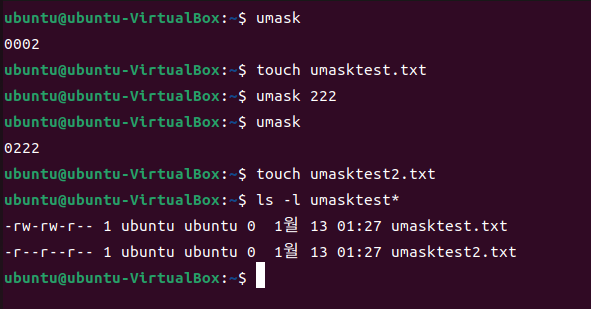

# 모의 해킹으로 알아보는 리눅스 서버 해킹과 보안

### 목차

2. 리눅스 서버 관리 명령어

## 2. 리눅스 서버 관리 명령어

### 2.1 리눅스 기본 명령어

- ls

- cd

- pwd

- mkdir, 디렉터리 생성

  - -p 옵션으로 하위 디렉터리까지 한 번에 생성

- rmdir & rm, 파일 및 디렉터리 삭제

  - -r 은 하위 디렉터리까지 모두 삭제
  - -f 는 삭제 시 내용을 확인하지 않고 바로 삭제

- cp, 파일 및 디렉터리 복사

  - 복사하는 경우 현재 복사를 진행하는 사용자가 소유자가 된다. 복사 시 기존 소유자를 유지하고 싶으면 -p(preserve, 유지) 옵션을 사용해야 한다.

- mv, 파일 및 디렉터리 이동

- find, 파일 및 디렉터리 검색

  - 기본 형식

  ```
  find <경로> <검색 옵션> <동작>
  ```

  - -name <파일명> , -type <파일 종류>
  - 검색 된 파일 처리 -print(파일 경로 출력), -ls(검색 결과 목록 출력), -exec <명령(검색된 파일에 명령을 실행)
  
  - find로 검색할 때는 읽기 권한이 있어야 정상적으로 탐색이 가능하다.

- du & df, 파일 및 디렉터리 용량 확인

  - du(disk usage) : 특정 파일과 디렉터리의 용량을 표시
    - -s(sum, 합계 표시)
    - -h(easier to human, 읽기 쉬운 표시 형태)

  - df : 현재 사용 중인 디스크와 파일 시스템의 전체 용량 및 여유 공간을 표시
    - -k(KB 단위 표시)
    - -h(KB, MB, GB 단위 표시)

- tar, 파일 및 디렉터리의 압축(묶기)과 해제

  - tar 자체는 파일을 압축하는 명령어가 아닌 파일을 묶는 명령어

    - -z (gzip 압축)

    - -j (bzip 압축)

    - -c (파일 생성, 묶기)

    - -f (대상 지정)

    - -v (처리 정보를 표시)

    - -x (파일 압축 풀기)

      ```
      tar -cvf <이름> <압축 경로> # 해당 이름으로 압축 경로가 묶임
      tar -xvf # 현재 디렉터리에 압축 해제
      ```

- sudo, root 권한 실행 명령어

### 2.2 사용자 및 파일 권한 관리 명령어

- 리눅스에서 해킹할 때 일반 계정이나 root 계정을 탈취해서 로그인한 후 공격 대상에 침입한다.

- 또한 파일의 권한을 변경하여 악성 코드를 심거나 파일을 변조하기도 한다.

- whoami, 현재 사용자 확인

- adduser/useradd, 사용자 추가

  - -d : 홈 디렉터리를 변경
  - -g <그룹 ID>
  - -G <그룹명>

- userdel, 사용자 삭제

- usermod, 사용자 변경

  - 사용자의 설정(홈 디렉터리, 비밀번호, 그룹명 등)을 변경하고자 할 때
  - usermod <옵션> <사용자명>
  - -d (홈 디렉터리 변경)
  - -g (그룹 id 변경)
  - -p (비밀번호 변경)

- chmod, 파일 권한 변경

- chown, 파일 소유권 변경

  - 파일과 디렉터리의 소유자를 변경하기 위해

- chgrp, 파일 그룹 변경

  - 파일의 그룹을 변경하기 위해

- umask, 초기 파일 접근 권한 설정

  - 파일이나 디렉터리를 생성할 때 적용되는 접근 권한을 `umask`명령어를 사용해 설정

  - 옵션 없이 실행하면 현재 초기 파일 접근 권한이 출력됨

  - -S 옵션을 활용하면 비트로 출력되는 접근 권한 값을 문자로 출력할 수 있음

  - **umask 명령어를 실행하면 네 자리 숫자가 나오는데, 첫 번째 자리는 특수 접근 권한을 의미**

    

### 2.3 네트워크 관리 명령어

- ifconfig, 네트워크 인터페이스 및 정보 확인

  - 네트워크 장치 활성화/비활성화

  ```
  ifconfig <네트워크 이름> <up/down>
  ```

  - 최근에는 ip addr로 대체할 수 있음

  ```
  ip link set [네트워크 이름] [up/down]
  ```

- netstat, 네트워크 접속 정보 확인

  - 리눅스에서 현재 네트워크 상태와 TCP/UDP 접속 정보를 확인하기 위해 사용
  - -a (전체 접속 정보 출력)
  - -n (TCP 연결 정보 확인)
  - -r (라우팅 테이블 정보 출력)
  - 최근에는 netstat 명령어를 대체하는 ss 명령어를 사용

  ```
  ss -an
  ```

- route, 라우팅 테이블 확인 및 설정

  - 네트워크 통신 시 라우팅 테이블에 따라 경로를 탐색하게 되는데, 라우팅 경로를 확인하고 수동으로 라우팅 경로를 설정하려면 route 명령어를 사용한다.
  - add (라우팅 경로 추가)
  - del (라우팅 경로 삭제)
  - 수동으로 지정된 목적지 IP 대역에 대한 라우팅 경로를 설정

  ```
  add -net <목적지 IP 대역> netmask <넷마스크> gw <게이트웨이 주소> dev <인터페이스 명>
  ```

- ping, 원격지 네트워크 응답 확인

### 2.4 서비스 관리 명령어

- 리눅스는 다수의 프로그램을 체계적으로 관리하기 위해 서비스라는 개념이 존재

- 서버에 기본적으로 실행되어야 하는 시스템 관리 프로그램은 주로 서비스로 실행

- 서비스를 관리하기 위해 systemd라는 서비스 매니저 프로그램이 각각의 서비스를 관리

  

- systemctl, 서비스 관리

  - 서비스 실행, 중단, 재시작 등 서비스의 작동과 관련된 모든 부분은 systemctl 명령어로 이루어짐
  - systemctl start/stop/restart <서비스명> (서비스 실행/중단/재시작)
  - systemctl status <서비스명> (서비스 상태 확인)
  - systemctl enable/disable <서비스명> (부팅 시 서비스 자동 시작/중지)

## 3. 리눅스 시스템 보안 기초

- 

