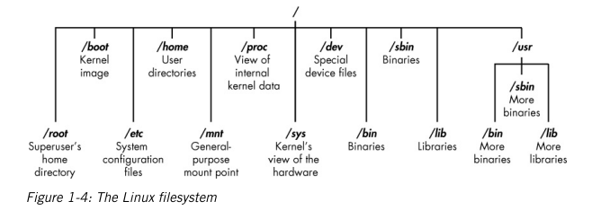

### 목차

1. 기본 다지기
1. 텍스트 조작

## Chapter 1. 기본 다지기

- 리눅스 파일 시스템
  - 파일 시스템의 루트(/)는 트리의 맨위에 존재
  - /root : 루트 사용자의 홈 디렉터리
  - /etc : 보통 리눅스 환경설정 파일을 포함. 환경설정 파일은 프로그램 시작을 언제 어떻게 할 것인지 제어하는 파일
  - /home : 사용자의 홈 디렉터리
  - /mnt : 다른 파일 시스템이 파일 시스템에 연결되거나 마운트되는 위치
  - /media : 보통 CD나 USB 장치가 파일 시스템에 연결되거나 마운트되는 위치
  - /bin : 애플리케이션 **바이너리**(마이크로소프트 윈도우의 실행 파일 또는 macOS의 애플리케이션과 같다)
  - /lib : 라이브러리가 위치한다(윈도우 DLL과 비슷한 공유 프로그램)



### 1.4 찾아보기

- locate를 이용한 검색

  - locate 명령 뒤에 찾고 싶은 것을 나타내는 키워드가 오면 이 명령은 전체 파일 시스템을 살펴보고 해당 단어의 모든 항목을 찾는다.

    ```bash
    $ locate aircrack-ng
    ```

  - 한계

    - locate는 일반적으로 하루에 한 번만 업데이트되는 데이터베이스를 사용하므로 다음날까지 목록에 나타나지 않을 수 있다.

- whereis로 바이너리 찾기

  - 바이너리 위치뿐 아니라 이용할 수 있는 소스와 메뉴얼 페이지도 반환

    ```bash
    $ whereis aircrack-ng
    ```

  

- which로 PATH 변수에서 바이너리 찾기

  - which 명령은 리눅스에서 PATH 변수의 바이너리 위치만 반환한다.
  - 운영체제가 명령줄에서 실행하는 명령을 찾는 디렉터리를 PATH가 가지고 있다.
  
  

- find로 더 강력한 검색 수행하기

  - 지정된 디렉터리에서 검색을 시작할 수 있음

  - 파일 이름, 생성 또는 수정 날짜, 소유자, 그룹, 권한 및 크기 모두 확인 가능

  - 기본 문법

    ```bash
    $ find [디렉터리] [옵션] [표현식]
    $ find / -type f -name apache2
    ```

  - 확장자가 있는 모든 파일

    ```bash
    $ find /etc -type f -name apache2.*
    ```

- grep으로 필터링하기

  - grep 명령은 출력이 한 명령에서 다른 명령으로 파이프로 연결될 때 자주 사용

  - 실행 중인 모든 프로세스의 목록 출력

    ```bash
    $ ps aux
    ```

  - 파이프를 사용하면 리눅스에서 한 명령의 **출력**을 가져와 다른 명령의 **입력**으로 보낼 수 있다
  
    ```bash
    $ ps -ef | grep apache2
    ```
  

### 1.5 파일 및 디렉터리 수정

- 파일 생성

  - **cat으로 연결하기**

    cat 명령 뒤에 **> 기호**로 표시된 리다이렉션과 만들고자 하는 파일의 이름을 붙인다.

    ```bash
    $ cat > hackingskills
    Hacking is the most valuable skill set of the 21st century!
    ```

    **파일에 더 많은 내용을 추가하려면** 이중 리다이렉션과 함께 cat 명령을 사용하여 파일 끝에 추가할 내용을 더하면 된다.

    ```bash
    $ cat >> hackingskills
    Everyone should learn hacking
    ```

## Chapter 2. 텍스트 조작

### 2.2 grep으로 텍스트 필터링

- 네트워크 침투 탐지 시스템(network instrusion detection system) - Snort

- grep으로 텍스트 필터링

  - snort.conf에 output단어를 포함하는 줄

  ```
  $ cat /etc/snort/snort.conf | grep output
  ```

### 2. 3 sed를 사용한 찾아 바꾸기

- sed를 사용하여 키워드 또는 문구를 찾아 바꾸기 (mysql -> MySQL)

```bash
$ sed s/mysql/MySQL/g /etc/snort/snort.conf > snort2.conf
```

- `s` 명령은 치환(subsituation)

- 사용자는 먼저 찾고자 하는 단어(mysql)을 제공

- 바꿀 단어(MySQL)제공

- 각각은 슬래시(/)로 구분

- `g` 플래그는 리눅스에게 이 치환을 파일 전체에게 실행하라고 말하는 것

  - g플래그를 제거하면 처음 나타나는 mysql만을 변경할 수 있다.

  - 두 번째 mysql 만을 바꾸길 원한다면

    ```bash
    $ sed s/mysql/MySQL/2 snort.conf > snort2.conf
    ```

- 결과는 snort2.conf 파일에 저장

### 2.4 more와 less 를 통한 파일 조회

- more를 통한 출력 제어

  - more 명령어는 한 번에 한 페이지만 출력 -> 엔터키를 사용해서 페이지를 아래로 내릴 수 있음

  ``` bash
  $ more /etc/snort/snort.conf
  ```

- less를 통한 출력과 필터링

  - 필터링도 가능 (output을 검색)
  
  ```
  $ less /etc/snort/snort.conf /output
  ```

  - /를 통해서 ouput을 검색할 수 있다.

  - n(다음 next을 의미)을 입력하면 outpuit의 다음 발견 위치를 볼 수 있다.
  
    


