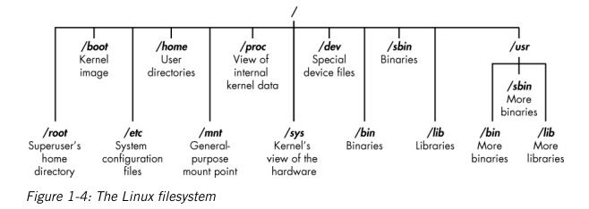

### 목차

1. 기본 다지기

## Chapter 1. 기본 다지기

- 리눅스 파일 시스템
  - 파일 시스템의 루트(/)는 트리의 맨위에 존재
  - /root : 루트 사용자의 홈 디렉터리
  - /etc : 보통 리눅스 환경설정 파일을 포함. 환경설정 파일은 프로그램 시작을 언제 어떻게 할 것인지 제어하는 파일
  - /home : 사용자의 홈 디렉터리
  - /mnt : 다른 파일 시스템이 파일 시스템에 연결되거나 마운트되는 위치
  - /media : 보통 CD나 USB 장치가 파일 시스템에 연결되거나 마운트되는 위치
  - /bin : 애플리케이션 **바이너리**(마이크로소프트 윈도우의 실행 파일 또는 macOS의 애플리케이션과 같다)
  - /lib : 라이브러리가 위치한다(윈도우 DLL과 비슷한 공유 프로그램)

### 1.4 찾아보기

- locate를 이용한 검색
- 